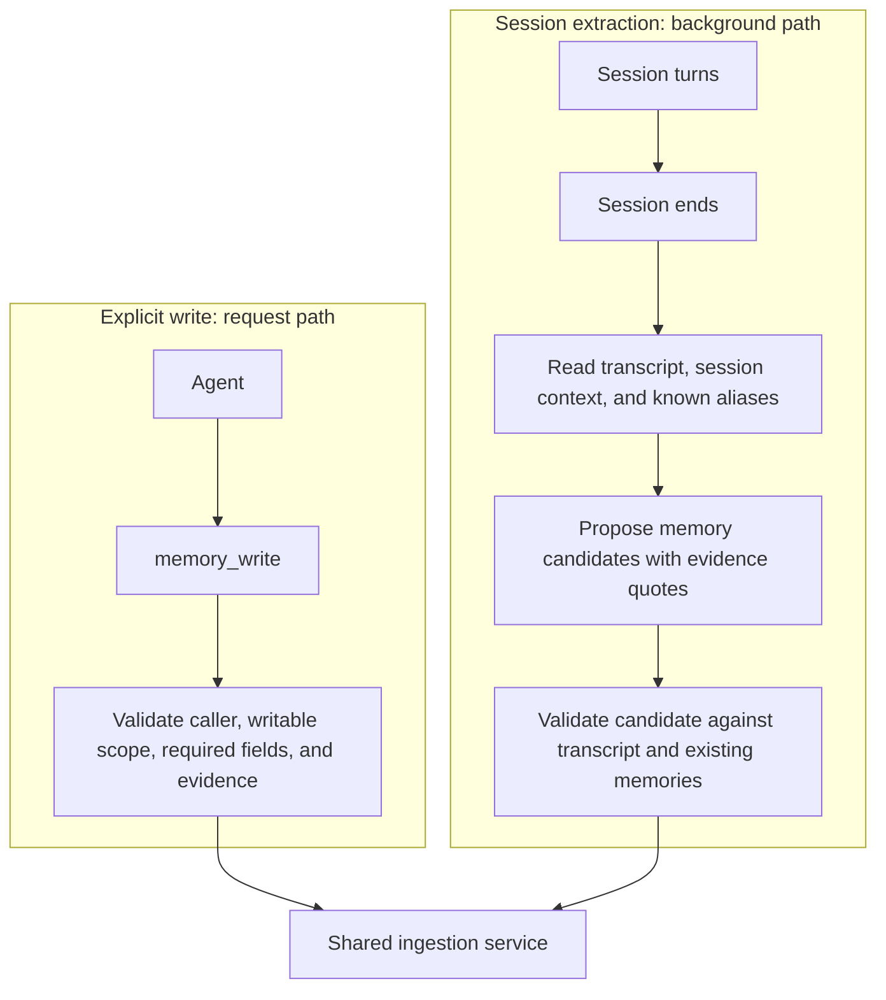
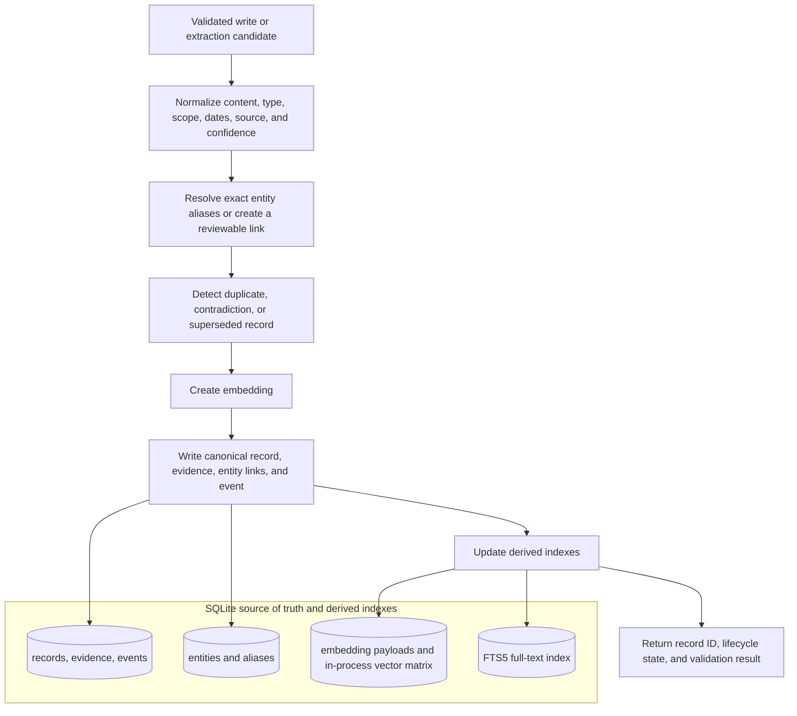
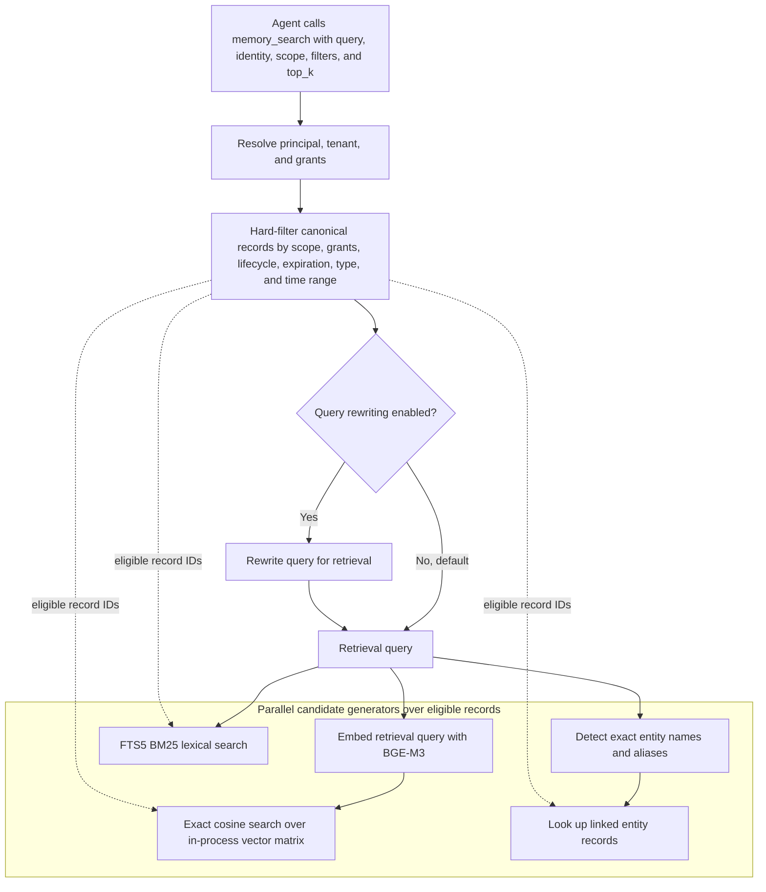
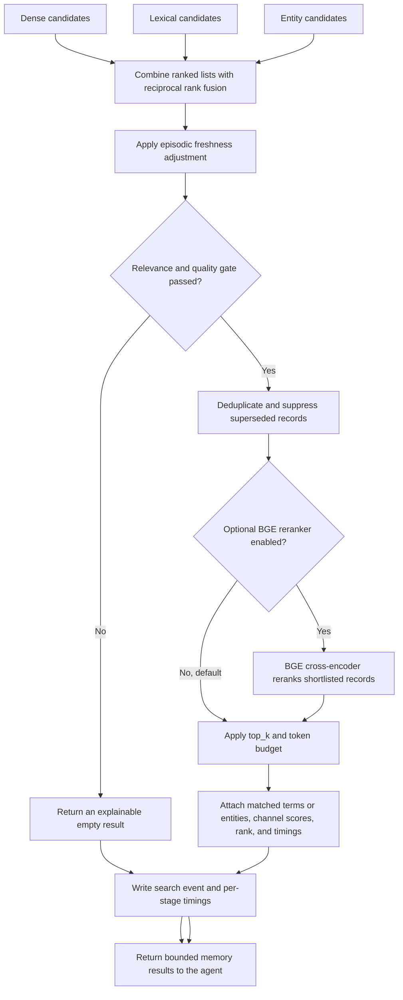

# Agent Memory System

## 1. Introduction

Agent Memory System is a long-term memory layer for AI agents. It does not depend on one model provider or agent framework. It stores facts, decisions, and dated experiences outside the conversation. Agents call `memory_search`, `memory_get`, `memory_write`, `memory_revise`, and `memory_forget` to retrieve, create, revise, or forget those records.

The transcript is raw material. Each record carries scope, source, evidence, lifecycle metadata, and retrieval context. The design runs locally. SQLite holds the canonical records. Vector, full-text, and entity indexes are rebuilt from that store.

## 2. Why

An LLM call retains nothing. Replaying the transcript keeps one conversation coherent. It costs tokens, mixes temporary chat with durable claims, and does not carry knowledge into a later session or a different agent.

You need a place for a user's preference, a project convention, or the outcome of a previous attempt. The store scopes that record, retrieves it for the matching task, and lets someone inspect or correct it.

## 3. Guarantees

| Characteristic | What the system guarantees |
| --- | --- |
| Durable canonical store | SQLite holds the memory record, metadata, source data, event history, vector payload, and full-text index. You can rebuild the search indexes from it. |
| Tool-mediated access | Agents use `memory_search`, `memory_get`, `memory_write`, `memory_revise`, and `memory_forget`. Memory enters the conversation after a tool call or a host-issued search that uses the same handler. |
| Stable prompt prefix | Integrators keep the base prompt stable for provider-side caching. An agent calls a memory tool and receives the result as a tool message. |
| Isolation | The retriever applies scope, principal identity, grants, lifecycle state, expiration, and record type as filters before ranking. An ineligible record stays out of the result. |
| Source and evidence | A stored record includes its source, creator, timestamps, confidence, and a supporting transcript or tool quote. A user statement and an inference are different source kinds. |
| Lifecycle | A record is provisional, confirmed, superseded, expired, or forgotten. A revision stores the reason. |
| Explainable retrieval | A result includes matched terms or entity, contributing channels, score components, and final rank. |
| Entity linking | The service links records through entity aliases. It leaves an ambiguous name unmerged for review. |
| Model and framework | The storage contract and tool schemas do not depend on one provider or framework. Adapters target Deep Agents and CrewAI. |
| Background work | An agent waits for `memory_write` to finish. Session extraction runs after the session, off the message path. |

## 4. Ingestion

An agent can write a memory during a session. After the session ends, an extractor can propose more records from the transcript. Both routes go through the same validation and persistence rules.

### 4.1 Write paths

### 4.2 Record validation and persistence

| Route | When it runs | What it is for |
| --- | --- | --- |
| Explicit write | During the agent's work, synchronously | The agent has a fact, decision, or correction worth retaining and supplies evidence for it. |
| Session extraction | After the session ends, asynchronously | Facts or episodes the agent did not save. Each candidate cites a source turn. |

Per-message extraction is out. It would charge every turn and store guesses from an unfinished conversation. The session-end pass reads the full transcript and can write one episodic summary plus durable candidates.

## 5. Retrieval

An agent starts retrieval by calling `memory_search`. The base prompt does not contain stored memories. The service finds records that caller may read, then runs dense, lexical, and entity generators in parallel. The relevance gate can return an empty list.

### 5.1 Access control and candidate generation

### 5.2 Ranking and result construction

| Channel | Current method | Best at |
| --- | --- | --- |
| Dense | BGE-M3 query embedding plus exact cosine similarity over the in-process matrix | Semantic matches where the query and memory use different words. |
| Lexical | SQLite FTS5 with BM25 ranking | Exact terms, identifiers, error messages, commands, and code-like language. |
| Entity | Exact canonical-name and alias lookup, then linked-record lookup | People, projects, systems, repositories, and other named subjects. |

The service logs timing for candidate generation, fusion, reranking, and result construction. Query rewriting and the reranker are in the pipeline and off by default. Turn them on after the benchmark shows they earn their latency.

## 6. Search trigger and the relevance gate

Whether a stored memory reaches the model comes down to two decisions: who decides to search, and whether what the search found is worth showing. Both are configuration, both are logged, and both are measured by the benchmark.

### 6.1 Who triggers a search

`retrieval.trigger.mode` decides who calls `memory_search`. Everything after that call is the same in every mode.

| Mode | Who searches | When to use it |
| --- | --- | --- |
| `tool_only` | The model, when it decides memory might help. | Agents that do tasks: coding, research, workflows. The task makes it obvious when the past matters ("like last time", "what did we decide about X"), and models search reliably in that situation. The default. |
| `auto` | The host, once before every model turn, with the user's message as the query. The model has no search tool of its own. | Experiments only. It isolates the host trigger so the benchmark can measure it. Not for production, since the model cannot search for anything more specific than the current message. |
| `hybrid` | Both. The host searches once per user turn; the model can also search whenever it wants. | Assistants that talk to one person across many sessions and should remember preferences without being asked. The host search catches what the model would never think to look for; the model's own searches handle targeted follow-ups, time windows, a particular person or project, or a provenance check before trusting a record. The intended production mode for assistants, once the benchmark confirms it. |

The second and third modes exist because of one weakness in model-triggered search. Models search well when the user points at the past and poorly when nothing in the message does, even though a stored preference should still shape the answer. A user who once said "keep answers short" will not say it again, and a model that only searches when prompted will not look.

> [!IMPORTANT]
> Searching on every turn is normally where pollution comes from, because most memory layers then paste the top results into the prompt however weak they are. Here a host-issued search goes through the same gate as a model-issued one, so on an ordinary turn the usual outcome is that nothing comes back.

When something does come back, it is appended to the conversation as a new message, the way a tool result would be. The system prompt and earlier messages are never edited. That matters for cost: providers cache the unchanged beginning of a prompt across calls, and the cache only hits if that beginning stays byte-for-byte identical. Editing memory into the system prompt every turn would break it; appending does not.

### 6.2 The relevance gate

Every search ends with a gate whose job is to return nothing unless something is worth returning.

1. **Each candidate must clear a floor on its own.** It passes if it is an exact match on a named entity, or its embedding similarity is above the floor for its record type (episodic summaries are long and score lower against short queries, so they get a lower floor), or it matches enough of the query's words and at least two of them, unless one matched word is precise on its own, such as an identifier (`ERR42`, `bge-m3`) or an entity name. That last rule stops a one-word query like "deployment" from pulling in every record that mentions deployment.
2. **Weak survivors are dropped relative to the strongest.** A record found by several retrieval channels scores well above one found by a single channel. Anything below a set fraction of the top survivor is dropped, except exact entity matches. When no record stands out, this step removes little.
3. **If nothing is left, the result is empty**, and the response says which floors the best candidate missed. Every drop keeps its reason and every score is logged, so floors can be retuned by replaying old searches.

The store already holds: prefers vim, drinks oat milk, last week's PR on the settings page, a note that the save button used to be green.

**Type 1: a question the store can answer.** "What editor do I use?" The vim memory is the answer. Search should return it. If the floor is too strict, this fails.

**Type 2: a question the store cannot answer.** "What's my dog's name?" There is no dog memory. Search will still find something weakly related. The right result is empty. If the floor is too loose, a random memory leaks through.

**Type 3: not a memory question at all.** "Can you make the button blue?" Nobody asked about the past. In `auto` and `hybrid`, the host still searches, using that message as the query. The store is this person's real work, so search surfaces the old "save button was green" note: same user, overlapping words, middling score. That note is a true memory and still the wrong thing to paste into this turn. The right result is empty, same as type 2, for a different reason.

> [!NOTE]
> Type 2 and type 3 both want empty, and they are not the same test. Type 2 is easy to keep empty because nothing in the store is about a dog, so scores stay low. Type 3 is hard because the store is about this user's UI work, so scores look relevant enough. That is the case host search sees on most turns: "thanks", "look at this PR", "make the button blue".

The numbers in config today are starting values. When the floors are chosen, they should hold on all three. LongMemEval and LoCoMo only contain types 1 and 2, because they only search on benchmark questions, never on ordinary chat. ***The type 3 sweep is specified in the low-level design as an offline pass over `search_log`. It is not in this repository yet.***

The gate judges relevance to the query's words, not whether the task needed the memory. A coffee-habit memory will pass on any coffee question. In `tool_only` the model makes that call by choosing to search. In `auto` and `hybrid`, keeping type 3 empty is the intended check.

### 6.3 How other systems handle this

Public interfaces as of September 2026, only where the behaviour is unambiguous from the interface itself:

- ChatGPT's memory feature places saved memories into the model's context for every conversation. There is no per-request decision about relevance.
- Mem0's open-source `Memory.search` applies a similarity threshold, default `0.1`, then returns up to `top_k` results, default `20`. A cutoff that low admits almost any candidate, so in practice the caller receives the top results.
- LangGraph's `BaseStore.search`, which LangMem builds on, returns up to `limit` results, default `10`, with no score threshold.

In each of these, something is returned on every search. Here, an empty result is the expected outcome on an ordinary turn, and every non-empty one carries the reason it got through.

## 7. Integration

Not in this README yet: installation, persistence setup, tool registration, and examples for a standalone agent, Deep Agents, and CrewAI.

## 8. Tunables

Not in this README yet: retrieval thresholds, `top_k`, token budgets, scope and lifecycle filters, embedding and reranker models, query rewriting, extraction policy, and timing instrumentation.

## 9. Code structure

Not in this README yet: package layout, SQLite schema, memory service boundaries, adapters, CLI, and tests.

## 10. Design documents

- [Research notes and initial design specification](docs/agent-memory-research-notes.md)
- [Component guide with examples](docs/components.md)
- [High-level design](docs/agent-memory-hld.md)
- [Low-level design](docs/agent-memory-lld.md)

Commits follow [Conventional Commits](https://www.conventionalcommits.org/). After cloning, run `git config core.hooksPath .githooks`.

The repo holds the design and a growing implementation.
