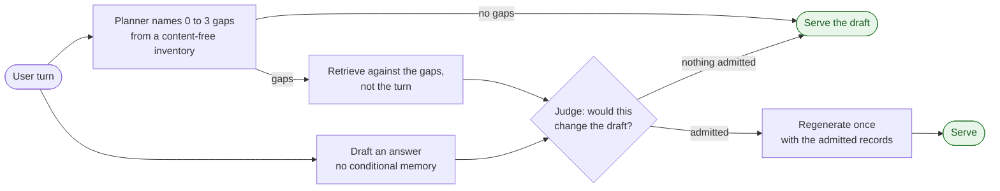

<h1 align="center">Retold</h1>

<p align="center"><strong>Long-term memory for AI agents that stays quiet until it changes the answer.</strong></p>

<p align="center">
  <a href="https://adimyth.in/retold/"></a>
  <a href="https://github.com/adimyth/retold/actions/workflows/ci.yml"></a>
  
  <a href="LICENSE"></a>
</p>

Retold gives an agent durable, scoped memory in one SQLite file: facts, decisions, and dated experiences about a user or a project, each backed by a verbatim quote and a lifecycle. It retrieves through dense, lexical, and entity channels, returns only what the caller may read, and can return nothing. Every search explains itself.

Any agent framework can register its five JSON-schema tools; adapters for Deep Agents and CrewAI ship as worked examples. **[Documentation](https://adimyth.in/retold/)** · `pip install "retold[local-models]"`

## Decide before you retrieve

Every memory layer retrieves by similarity and injects the top results. Similarity answers *is this record about the same subject as the turn*. It cannot answer *does this turn need remembered state*, and the two come apart on exactly the turns that matter: the store holds "use Python for code examples" and the user asks "tabs or spaces in Python?". Related, and irrelevant.

Measured on a scripted conversation, the best similarity score per turn looked like this:

| Turn class | min | median | max |
| --- | :-: | :-: | :-: |
| Ordinary, no memory needed | 0.44 | 0.56 | **0.63** |
| Memory genuinely applies | 0.50 | 0.57 | 0.62 |

No threshold separates them. Every floor trades one useful recall for one unwanted injection.

Retold answers the second question with a different mechanism. The host drafts an answer without conditional memory, a planner names what the draft is missing, retrieval runs on those gaps, and a judge admits a record only if it would change the draft.



Every stage fails closed to the draft: a timeout, a malformed policy reply, an unavailable provider, or an exhausted latency budget serves the draft and logs why. A turn with no gaps costs nothing extra, because the planner finishes before the draft does.

> **On two blind scenario splits and a shadow harness:** at most 1 of 20 ordinary turns received memory, explicit stored facts were recalled 10 of 10 and 9 of 10 times, implicit needs 7 of 8 and 6 of 7, and nothing placebo, misleading, private, or unsafe was ever admitted.

Two more things make this work in practice. Stable response preferences ("answer concisely", "reply in Hindi") never go through this path; an audited activation policy promotes them into a small **ambient profile** fixed at session start. And the models, prompts, taxonomy, and retrieval settings that produced those numbers are hashed into a **bundle**; a store serves a bundle only after a passing fitness result is recorded for it, and runs it in shadow mode otherwise.

The path sits in the family opened by [RUMS](https://arxiv.org/abs/2604.14473) and [TRACE-Memory](https://arxiv.org/abs/2608.08446). What Retold adds is the ambient-versus-conditional split, the content-free inventory the planner sees instead of the records, joint draft-relative admission, and the control plane around them: shadow mode, per-stage kill switches, a decision log, and bundle gating. [The comparison](docs/design-contributions.md).

## Three rules

- **A bad record is worse than a missing one.** A claim attributed to the user must be backed by a transcript quote that entails it, or it becomes an inference that expires unless it is seen again. Contradictions are settled by source authority, and the losing record stays as lineage.
- **An irrelevant retrieval is worse than an empty one.** Search ends with a gate that can return nothing and says why.
- **Nothing enters the prompt prefix.** Memory arrives as a tool result, so provider-side prompt caching keeps working. The ambient profile is the one exception, and it is fixed for the session.

## Quick start

```bash
pip install "retold[local-models]"     # bge-m3 embedder, NLI judge; add deepagents or crewai for an adapter
```

Three lines open a store, allow an agent to read and write one user's memory, and build the runtime:

```python
from retold import MemoryHost, Scope, Store, build_runtime, load_config

store = Store("memory.sqlite")
MemoryHost(store).grant("assistant", Scope(kind="user", id="aditya"), read=True, write=True)
runtime = build_runtime(load_config(), store)
```

Hand the runtime to an adapter and the framework does the rest: tools registered, identity taken from the run, turns captured, extraction scheduled at session end.

```python
from deepagents import create_deep_agent
from retold.adapters.deepagents import DeepAgentsMemoryAdapter

adapter = DeepAgentsMemoryAdapter(runtime)
agent = create_deep_agent(model=model, tools=adapter.tools(),
                          system_prompt=adapter.system_prompt("You are a helpful assistant."),
                          middleware=[adapter.middleware()])
agent.invoke({"messages": [...]}, {"configurable": {"thread_id": "s1", "agent_id": "assistant", "user_id": "aditya"}})
```

The grant is the one deliberate step: isolation is enforced by scope and grant before anything is ranked, so an agent reads nothing it was not given. Without an adapter, the same runtime exposes `runtime.handlers` (the five tools as Python calls) and `runtime.hooks` (session start, turn, end). To turn on the utility-aware path, build the adapter with `memory_mode="utility_aware"` and the measured bundle from `retold.policy.reference`; the [guide](https://adimyth.in/retold/guide/using/) walks through it, and `examples/` runs both adapters with fakes and no keys.

## How it works

**The record.** One envelope for every memory: `content`, a type (`semantic`, `episodic`, `procedural`), a scope (`user`, `project`, `org`, or a private agent scope), a source kind ranked by authority, the verbatim `evidence`, event and validity times, a status (`provisional`, `confirmed`, `superseded`, `expired`, `deleted`), and an activation (`conditional` or `ambient`). A current fact is keyed by entity and attribute, so "Aditya's editor" has one live answer and a chain of superseded rows behind it. A user statement or tool result starts confirmed; an inference starts provisional and expires in 30 days unless reinforced.

**Two ways in.** An agent calls `memory_write` during the session with content, evidence, and entity mentions; the quote is located in the transcript and checked for entailment with a local NLI model before the record is compared against what exists and created, reinforced, superseded, or marked conflicting. After the session, an extractor proposes candidates from the whole transcript and a separate reviewer accepts, rejects, or narrows each one before the same validation path. There is no per-message extraction.

**One way out.** `memory_search` filters by scope, lifecycle, type, and time before any candidate exists; generates candidates from three channels; fuses them by reciprocal rank; applies recency decay to episodes; gates each survivor on its own evidence; collapses near-duplicates; fills the result within a token budget; and writes one log row with every candidate, score, decision, and stage timing. Warm searches take about 23 ms on a thousand records and 74 ms on fifty thousand.

**Who searches.** In `tool_only`, the default, the model searches when it decides to. The utility-aware host path runs beside it for the turns the model would never search for. `auto` and `hybrid`, where the host searches on every turn, exist as experimental controls and are refused together with the utility-aware path, since they would put records in front of the model before admission decided anything.

Full detail, with diagrams: [Architecture](https://adimyth.in/retold/guide/architecture/) · [Components](docs/components.md) · [Low-level design](docs/agent-memory-lld.md)

## Configuration

One YAML file, every value defaulted and validated. These are the keys an integrator is likely to touch; [the low-level design](docs/agent-memory-lld.md#2-configuration) explains all of them.

| Key | Default | What it does |
| --- | --- | --- |
| `retrieval.trigger.mode` | `tool_only` | Who calls `memory_search`. |
| `retrieval.gate.dense_floor.<type>` | 0.45 semantic, 0.40 episodic | The cosine a dense-only candidate must reach. Swept on a labelled fixture; the default sits inside the band whose F1 is within 90% of the best. |
| `retrieval.gate.auto.*` | stricter floors, no entity exemption | The gate for host-issued searches. |
| `retrieval.default_k`, `token_budget` | 8, 1500 | Results returned and the tool-result ceiling. |
| `embedding.model`, `version` | `BAAI/bge-m3`, `"1"` | Every stored vector carries both; changing either is a migration that recalibrates the floors. |
| `ingestion.evidence.entail_floor` | 0.70 | How strongly a quote must support a direct claim. |
| `ingestion.provisional_ttl_days`, `reinforcements_to_confirm` | 30, 2 | Lifecycle of inferences. |
| `ingestion.extraction_model`, `review_model` | `claude-haiku-4-5-20251001` | The two hosted models in the background write path. |
| `reranker.enabled`, `retrieval.rewrite.enabled` | off | A cross-encoder and a query rewriter. Both built, both measured, neither helped. |

The utility-aware path is configured by the host that owns the model clients, through `UtilityAwareConfig` and `supported_bundle()`, not through this file.

## What the numbers say

- **It stays quiet.** On ordinary turns, the ones public memory benchmarks never test, the utility-aware path injected on at most 1 of 20, against a target of 5%.
- **It still remembers.** Explicit stored facts came back 10 of 10 and 9 of 10 times; implicit needs 7 of 8 and 6 of 7. Every eligible response preference was promoted to the ambient profile, and the one unsafe candidate went to review.
- **It never admitted anything harmful.** Zero placebo, misleading, private, or unsafe records across every run of the suite, and every fail-closed branch is tested.
- **It leaks nothing.** Zero cross-principal violations on a synthetic four-user store and a 1,074-record fixture, checked at every log stage, through `memory_get`, and against grants.
- **It is cheap to call.** Warm search p50 23 ms on 1K records and 74 ms on 50K; write p50 26 ms; four concurrent writers beside two extraction workers with zero lock errors.
- **It knows what does not work.** A cross-encoder reranker and a query rewriter were built and measured in every placement; both removed the records the judge needed and neither is enabled. The only judge that passed the safety bar was one of three frontier models tried, and that result is pinned in the bundle rather than assumed of the next model.

All of it is in the [acceptance report](docs/acceptance-report.md) and the [experiment record](docs/usefulness-gate.md), with the run behind each number.

## Status

Version 1.0.1, MIT licensed, Python 3.12 and 3.13, one process, one database file. `tool_only` is the default. The utility-aware path is validated offline on blind splits and a shadow harness, ships with the measured bundle, and is off until a consuming host validates it on real traffic. v1.0.0 was tagged under the project's previous name, Memory Weave.

## Documentation

**Guide:** [Architecture](https://adimyth.in/retold/guide/architecture/) · [Using it](https://adimyth.in/retold/guide/using/) · [Configuration](https://adimyth.in/retold/guide/configuration/) · [API reference](https://adimyth.in/retold/api/)

**Design:** [Components](docs/components.md) · [High-level design](docs/agent-memory-hld.md) · [Low-level design](docs/agent-memory-lld.md) · [Utility-aware architecture](docs/utility-aware-memory-architecture.md) · [What is distinctive](docs/design-contributions.md)

**Evidence:** [Acceptance report](docs/acceptance-report.md) · [The gate](docs/gate.md) · [Usefulness, not relevance](docs/usefulness-gate.md) · [Benchmark handoff](BENCHMARK_HANDOFF.md) · [Experiments](benchmarks/README.md)

## License

MIT. Commits follow [Conventional Commits](https://www.conventionalcommits.org/); after cloning, run `git config core.hooksPath .githooks`.
