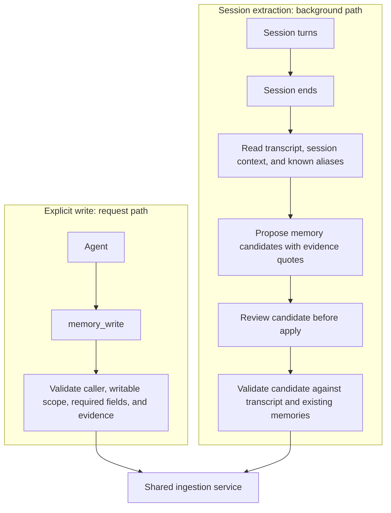
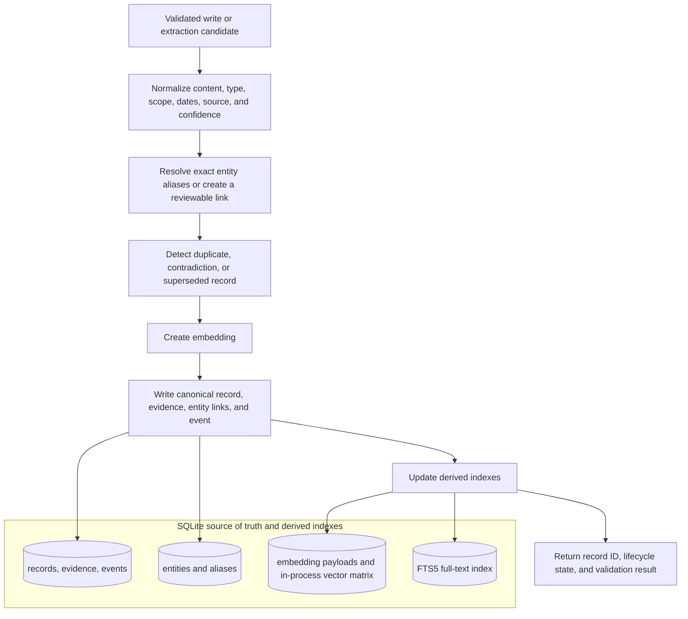
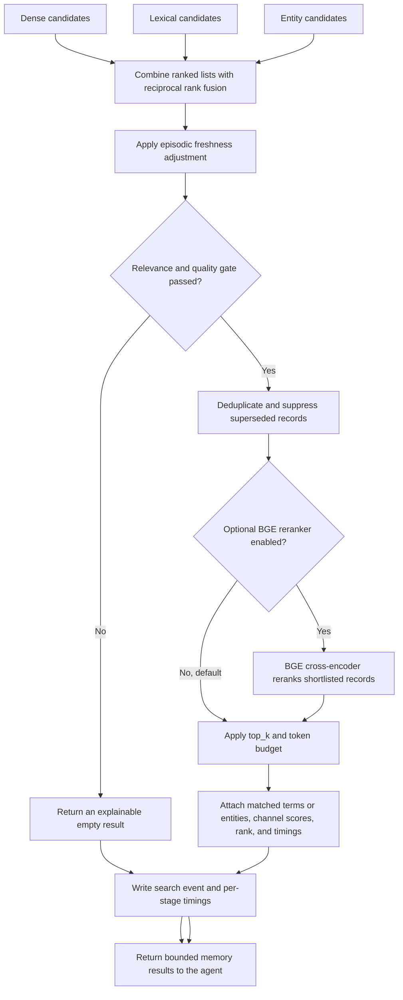

# Agent Memory System

## 1. Introduction

Agent Memory System is a long-term memory layer for AI agents. It does not depend on one model provider or agent framework. It stores facts, decisions, and dated experiences outside the conversation. Agents call `memory_search`, `memory_get`, `memory_write`, `memory_revise`, and `memory_forget` to retrieve, create, revise, or forget those records.

The transcript is raw material. Each record carries scope, source, evidence, lifecycle metadata, and retrieval context. The design runs locally. SQLite holds the canonical records. Vector, full-text, and entity indexes are rebuilt from that store.

The authoritative design for host-issued memory use is [Utility-aware memory architecture](docs/utility-aware-memory-architecture.md), with delivery stages in the [utility-aware memory implementation plan](docs/utility-aware-memory-implementation-plan.md). The current implementation still defaults to `tool_only`; the new ambient-profile and utility-aware host paths remain evaluation-gated and disabled until their acceptance criteria are met.

## 2. Why

An LLM call retains nothing. Replaying the transcript keeps one conversation coherent. It costs tokens, mixes temporary chat with durable claims, and does not carry knowledge into a later session or a different agent.

You need a place for a user's preference, a project convention, or the outcome of a previous attempt. The store scopes that record, retrieves it for the matching task, and lets someone inspect or correct it.

## 3. Guarantees

| Characteristic | What the system guarantees |
| --- | --- |
| Durable canonical store | SQLite holds the memory record, metadata, source data, event history, vector payload, and full-text index. You can rebuild the search indexes from it. |
| Tool-mediated access | Agents use `memory_search`, `memory_get`, `memory_write`, `memory_revise`, and `memory_forget`. Conditional memory enters the conversation after a tool call or a utility-aware host decision. |
| Stable prompt prefix | Integrators keep the base prompt stable for provider-side caching. The planned bounded ambient profile is assembled once per session; conditional memory is appended only after admission. |
| Isolation | The retriever applies scope, principal identity, grants, lifecycle state, expiration, and record type as filters before ranking. An ineligible record stays out of the result. |
| Source and evidence | A stored record includes its source, creator, timestamps, confidence, and a supporting transcript or tool quote. A direct user or tool claim must be supported by that quote. |
| Lifecycle | A record is provisional, confirmed, superseded, expired, or forgotten. A revision stores the reason. |
| Explainable retrieval | A result includes matched terms or entity, contributing channels, score components, and final rank. |
| Entity linking | The service links records through entity aliases. It leaves an ambiguous name unmerged for review. |
| Model and framework | The storage contract and tool schemas do not depend on one provider or framework. Framework adapters are planned; none is included yet. |
| Background work | An agent waits for `memory_write` to finish. Session extraction, pre-apply candidate review, and due temporal review run off the message path. |

## 4. Ingestion

An agent can write a memory during a session. After the session ends, an extractor can propose more records from the transcript. A separate reviewer accepts, rejects, or narrows extracted candidates before accepted candidates enter the shared validation and persistence path. Time-sensitive records can later be flagged for review when an evidence-backed `review_at` time arrives; the system does not infer that a planned event happened.

### 4.1 Write paths

### 4.2 Record validation and persistence

| Route | When it runs | What it is for |
| --- | --- | --- |
| Explicit write | During the agent's work, synchronously | The agent has a fact, decision, or correction worth retaining and supplies evidence for it. |
| Session extraction | After the session ends, asynchronously | Facts or episodes the agent did not save. Each candidate cites a source turn. |

Per-message extraction is out. It would charge every turn and store guesses from an unfinished conversation. The session-end pass reads the full transcript and can write one episodic summary plus durable candidates.

## 5. Retrieval

An agent starts retrieval by calling `memory_search`. The base prompt does not contain stored memories. The service finds records that caller may read, then runs dense, lexical, and entity generators sequentially. The relevance gate can return an empty list. The benchmark must justify adding generator concurrency.

### 5.1 Access control and candidate generation

### 5.2 Ranking and result construction

| Channel | Current method | Best at |
| --- | --- | --- |
| Dense | BGE-M3 query embedding plus exact cosine similarity over the in-process matrix | Semantic matches where the query and memory use different words. |
| Lexical | SQLite FTS5 with BM25 ranking | Exact terms, identifiers, error messages, commands, and code-like language. |
| Entity | Exact canonical-name and alias lookup, then linked-record lookup | People, projects, systems, repositories, and other named subjects. |

The service logs timing for candidate generation, fusion, reranking, and result construction. Query rewriting and the reranker are in the pipeline and off by default. Turn them on after the benchmark shows they earn their latency.

## 6. Search trigger and the relevance gate

Whether a stored memory reaches the model comes down to two decisions: who decides to search, and whether what the search found is worth showing. Both are configuration, both are logged, and both are measured by the benchmark.

### 6.1 Who triggers a search

`retrieval.trigger.mode` decides who calls `memory_search`. Everything after that call is the same in every mode.

| Mode | Who searches | When to use it |
| --- | --- | --- |
| `tool_only` | The model, when it decides memory might help. | Agents that do tasks: coding, research, workflows. The task makes it obvious when the past matters ("like last time", "what did we decide about X"), and models search reliably in that situation. The default. |
| `auto` | The host, once before every model turn, with the user's message as the query. The model has no search tool of its own. | Experiments only. It isolates the host trigger so the benchmark can measure it. Not for production, since the model cannot search for anything more specific than the current message. |
| `hybrid` | Both. The host searches once per user turn; the model can also search whenever it wants. | Assistants that talk to one person across many sessions and should remember preferences without being asked. The host search catches what the model would never think to look for; the model's own searches handle targeted follow-ups, time windows, a particular person or project, or a provenance check before trusting a record. The intended production mode for assistants, once the benchmark confirms it. |

The second and third modes exist because of one weakness in model-triggered search. Models search well when the user points at the past and poorly when nothing in the message does, even though a stored preference should still shape the answer. A user who once said "keep answers short" will not say it again, and a model that only searches when prompted will not look.

> [!IMPORTANT]
> Searching on every turn is normally where pollution comes from, because most memory layers then paste the top results into the prompt however weak they are. Here a host-issued search goes through the same gate as a model-issued one, so on an ordinary turn the usual outcome is that nothing comes back.

When something does come back, it is appended to the conversation as a new message, the way a tool result would be. The system prompt and earlier messages are never edited. That matters for cost: providers cache the unchanged beginning of a prompt across calls, and the cache only hits if that beginning stays byte-for-byte identical. Editing memory into the system prompt every turn would break it; appending does not.

### 6.2 The relevance gate

Every search ends with a gate whose job is to return nothing unless something is worth returning.

1. **Each candidate must clear a floor on its own.** It passes if it is an exact match on a named entity, or its embedding similarity is above the floor for its record type (episodic summaries are long and score lower against short queries, so they get a lower floor), or it matches enough of the query's words and at least two of them, unless one matched word is precise on its own, such as an identifier (`ERR42`, `bge-m3`) or an entity name. That last rule stops a one-word query like "deployment" from pulling in every record that mentions deployment.
2. **Weak survivors are dropped relative to the strongest.** A record found by several retrieval channels scores well above one found by a single channel. Anything below a set fraction of the top survivor is dropped, except exact entity matches. When no record stands out, this step removes little.
3. **If nothing is left, the result is empty**, and the response says which floors the best candidate missed. Every drop keeps its reason and every score is logged, so floors can be retuned by replaying old searches.

The store already holds: prefers vim, drinks oat milk, last week's PR on the settings page, a note that the save button used to be green.

**Type 1: a question the store can answer.** "What editor do I use?" The vim memory is the answer. Search should return it. If the floor is too strict, this fails.

**Type 2: a question the store cannot answer.** "What's my dog's name?" There is no dog memory. Search will still find something weakly related. The right result is empty. If the floor is too loose, a random memory leaks through.

**Type 3: not a memory question at all.** "Can you make the button blue?" Nobody asked about the past. In `auto` and `hybrid`, the host still searches, using that message as the query. The store is this person's real work, so search surfaces the old "save button was green" note: same user, overlapping words, middling score. That note is a true memory and still the wrong thing to paste into this turn. The right result is empty, same as type 2, for a different reason.

> [!NOTE]
> Type 2 and type 3 both want empty, and they are not the same test. Type 2 is easy to keep empty because nothing in the store is about a dog, so scores stay low. Type 3 is hard because the store is about this user's UI work, so scores look relevant enough. That is the case host search sees on most turns: "thanks", "look at this PR", "make the button blue".

The numbers in config today are starting values. When the floors are chosen, they should hold on all three. LongMemEval and LoCoMo only contain types 1 and 2, because they only search on benchmark questions, never on ordinary chat. ***The type 3 sweep is specified in the low-level design as an offline pass over `search_log`. It is not in this repository yet.***

The gate judges relevance to the query's words, not whether the task needed the memory. A coffee-habit memory will pass on any coffee question. In `tool_only` the model makes that call by choosing to search. In `auto` and `hybrid`, keeping type 3 empty is the intended check.

### 6.3 How other systems handle this

Public interfaces as of September 2026, only where the behaviour is unambiguous from the interface itself:

- ChatGPT's memory feature places saved memories into the model's context for every conversation. There is no per-request decision about relevance.
- Mem0's open-source `Memory.search` applies a similarity threshold, default `0.1`, then returns up to `top_k` results, default `20`. A cutoff that low admits almost any candidate, so in practice the caller receives the top results.
- LangGraph's `BaseStore.search`, which LangMem builds on, returns up to `limit` results, default `10`, with no score threshold.

In each of these, something is returned on every search. Here, an empty result is the expected outcome on an ordinary turn, and every non-empty one carries the reason it got through.

## 6.4 Known blocker: the gate cannot separate relevance from usefulness

This is the open problem in the design, and it is measured rather than suspected. The section below records the problem as first measured. Section 6.5 records the validated answer to it, which is the utility-aware host path.

One mechanism is being asked two different questions.

**"Is this record about the same subject as this query?"** is a property of a query-record pair, and
cosine similarity estimates it. That is the question the gate was built for and the one it answers.

**"Does this turn need remembered state?"** is a property of the turn alone. It does not depend on which
records exist, and no comparison between a query and a record can reveal it.

The two agree most of the time, which is why the design held together until it was measured. They come
apart on exactly the case the gate exists to catch: a turn whose subject matter overlaps the store but
whose answer does not depend on anything remembered. The store holds "use Python for code examples"; the
user asks "should I use tabs or spaces in Python?". Cosine is right that they are related. Nothing about
the answer changes because of what is remembered.

The Phase 9a hybrid run measured it. Across 36 host-issued searches, the best dense score per search was:

| Turn class | min | median | max |
| --- | --- | --- | --- |
| Ordinary, no memory needed | 0.44 | 0.56 | 0.63 |
| Memory genuinely applies | 0.50 | 0.57 | 0.62 |

The distributions overlap almost completely, and the ordinary turns reach a *higher* maximum. No dense
floor separates the two classes: every threshold trades a useful recall for an unwanted injection at
roughly one to one. Sweeping the floor from 0.55 to 0.65 takes ordinary injections from 6 of 12 down to
3 of 12, but useful recall falls from 3 of 6 to 0 of 6.

So the ordinary-turn injection target of under 5 percent is not reachable by tuning `dense_floor`. The
gate needs a different signal, not a better threshold. Candidates, in the order the evidence supports
them: the cross-encoder reranker as the final gate for host-issued searches, since it scores a
query-record pair rather than a vector distance; a usefulness judgement distinct from the relevance
gate; or accepting that `tool_only` is the supported mode and treating host-issued search as
experimental until one of the above is measured.

One change the data did justify and which is now the default: a host-issued search no longer exempts
exact entity matches from the gate. Those matches admitted memory on 3 of 12 ordinary turns and on 0 of
6 turns where memory applied, so the exemption was pure injection when the host, rather than the model,
asked. A model-issued search keeps the exemption, because there the model named the entity on purpose.

Full treatment, including how every other memory system faces the same problem and three ways to attack
it that can each be validated offline: [the gate](docs/gate.md). Raw numbers and method:
[Phase 9a findings](docs/vertical-slice-findings.md).

## 6.5 What the utility-aware path showed, and what model-agnostic means here

The answer to 6.4 is to stop scoring the query against the record and instead ask whether the record would change the answer. The host generates a draft with no conditional memory, a gap planner names the user-specific facts the draft is missing, retrieval runs on those gaps rather than on the turn, and a judge admits a record only if it would change the draft. The design is in [utility-aware memory architecture](docs/utility-aware-memory-architecture.md); the validation is in [usefulness-gate.md](docs/usefulness-gate.md) sections 8c and 8d.

On a held-out scenario set of 36 turns, with `gpt-4o` planning gaps and `gpt-5.4` judging admission, the path produced 0 of 20 ordinary-turn injections, 9 of 10 explicit stored-fact recalls, 5 of 6 implicit recalls, no placebo, misleading, stale, or unrelated private record admitted, and identical gap decisions across three repeats on every turn. Turns that needed no memory added no latency, because gap planning finished before the draft did. Preferences about how to answer never reached the answer unless they were placed in the always-present ambient profile, so ambient activation is a prerequisite for rollout, not an option.

A pre-registered run on a blind third split then held the safety half and missed the recall half: 0 of 20 ordinary injections and no unsafe admission again, but 8 of 10 explicit and 5 of 7 implicit recall against thresholds of 90% and 75%. The planner stayed silent on organisation-specific questions that lack a possessive such as "our" or "my". The fix was structural rather than a prompt edit: the planner now receives a bounded, content-free inventory of the fact categories the store holds for the principal. A pre-registered run on a blind fourth split, through the real ingestor and retriever, then passed: 1 of 20 ordinary injections, 9 of 10 explicit and 7 of 7 implicit recall, no unsafe admission, and stable gap decisions on every turn. The same run put ordinary turns in front of the judge for the first time and measured what it would admit if the planner had not been silent: nothing unsafe, but an adjacent fact on 3 of 19. The planner carries precision and the judge carries safety, and both numbers are now tracked. Sections 8e and 8f of the findings.

Phase 1A was then built: activation and category on every record, host-verified evidence, deterministic promotion with a review queue, a profile assembler, and an inventory generated from the store. A blind fifth split, pre-registered before that code existed, passed with automatic promotion and a store-generated inventory: 0 of 20 ordinary injections, 10 of 10 explicit and 7 of 8 implicit recall, no unsafe admission, all three eligible preferences promoted and the unsafe one sent to review. An independent second build promoted only two of three, because the classifier read a code-language preference's override clause as a scope; that is now a deterministic rule rather than a classifier call, pending confirmation on the next split. A gap-anchored judge was evaluated in the same round and rejected: it admitted a placebo on the fourth split and cost a recall on the fifth while adding no precision. Section 8g of the findings.

The same runs showed that the quality of this path depends on which model fills each role. Small reasoning models failed at both roles: unstable as planners, and as judges they admitted a misleading record and added tens of seconds. A mid-tier non-reasoning model was enough for planning. A frontier model was needed for judging.

The utility-aware path has since run end to end in shadow mode through the real ingestion, activation, retrieval, and admission pipeline, with the harness asserting that served responses, record activation, session turns, and the review queue were byte-identical with shadow on and off. Its decision log reproduced the blind-split results: 0 of 20 hypothetical ordinary injections, 10 of 10 explicit and 7 of 8 implicit recall, nothing unsafe. Section 8j of the findings.

The per-role fitness test has now been run across vendors. The planner role passes on a hosted mid-tier model and on an 8B open-weight model run locally. The judge role passes on frontier models from OpenAI, Anthropic, and Google, and fails on every non-frontier candidate tried: judging needs a frontier-class model, not a particular vendor's. Numbers per model and role are in section 8i of the findings.

> [!IMPORTANT]
> **What model-agnostic means for this system.** It does not mean the path works identically with any model; for a component whose quality depends on a model's judgement, nothing can. It means the contracts, the fail-closed orchestration, the ambient profile, the gap-first retrieval, the turn-decision log, and the acceptance gates are all model-neutral, and any candidate model's fitness for each role can be measured before it is enabled, in about ten minutes and a few dollars, with `benchmarks/phase0_two_arm.py` against the committed scenario sets. That is what vendor-neutrality looks like here: not indifference to the model, but a fixed acceptance test any model must pass. The design already calibrates admission per serving-model family for exactly this reason. Model names in this README are the ones that passed that test on the date given; they are configuration, and the test is the contract.

## 7. Run and test the vertical slice

The repository includes a provider-neutral integration harness for Anthropic, OpenAI, and OpenRouter. It replays a fixed conversation through a hosted model and the memory tools, saves one SQLite store per run, and writes a durable JSON result report. See [the vertical-slice guide](docs/vertical-slice-findings.md) for provider setup, deterministic checks, live-run commands, and saved-result locations.

## 8. Tunables

Not in this README yet: retrieval thresholds, `top_k`, token budgets, scope and lifecycle filters, embedding and reranker models, query rewriting, extraction policy, and timing instrumentation.

## 9. Code structure

Not in this README yet: package layout, SQLite schema, memory service boundaries, adapters, CLI, and tests.

## 10. Design documents

- [Research notes and initial design specification](docs/agent-memory-research-notes.md)
- [Component guide with examples](docs/components.md)
- [High-level design](docs/agent-memory-hld.md)
- [Low-level design](docs/agent-memory-lld.md)

Commits follow [Conventional Commits](https://www.conventionalcommits.org/). After cloning, run `git config core.hooksPath .githooks`.

The repo holds the design and a growing implementation.
