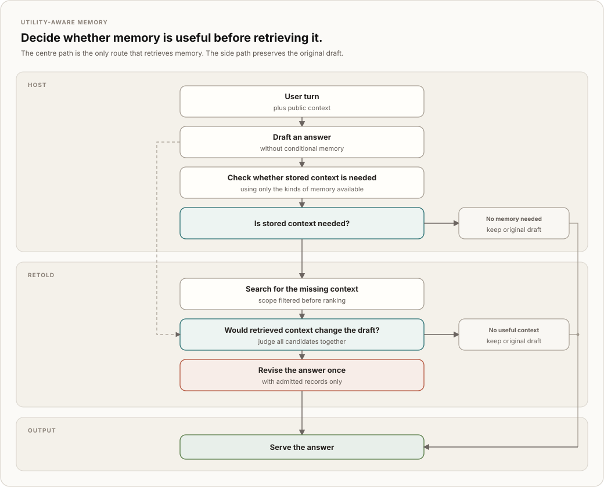

<h1 align="center">Retold</h1>

<p align="center"><strong>Long-term memory for AI agents, with evidence, isolation, and permission to return nothing.</strong></p>

<p align="center">
  <a href="https://adimyth.in/retold/"></a>
  <a href="https://github.com/adimyth/retold/actions/workflows/ci.yml"></a>
  
  <a href="LICENSE"></a>
</p>

Retold gives Python agents long-term memory that would rather return nothing than inject a vaguely related fact. Facts, decisions, and dated experiences live in one SQLite file, each with a verbatim source quote and isolated by agent, user, project, or organization. Search explains why it returned a record or nothing.

Storage, embeddings, retrieval, and evidence checks run locally. Background transcript extraction and the optional utility-aware path use a configured Anthropic or OpenAI model. An agent gets five tools: `memory_search`, `memory_get`, `memory_write`, `memory_revise`, and `memory_forget`.

Deep Agents and CrewAI adapters register those tools.

## Decide before you retrieve

Many agent-memory implementations retrieve by similarity and inject the top results. Similarity answers whether a record shares a subject with the current turn. It does not establish that remembered state would improve the answer.

On one scripted conversation, the highest similarity scores overlapped:[^2]

| Turn class | min | median | max |
| --- | :-: | :-: | :-: |
| Ordinary, no memory needed | 0.44 | 0.56 | **0.63** |
| Memory genuinely applies | 0.50 | 0.57 | 0.62 |

The utility-aware path was then evaluated on two blind scenario splits:

| | Blind split 1 | Blind split 2 |
| --- | :-: | :-: |
| Injected on ordinary turns | 1 of 20 | 0 of 20 |
| Recalled explicit stored facts | 10 of 10 | 9 of 10 |
| Recalled implicit needs | 7 of 8 | 6 of 7 |

> [!IMPORTANT]
> **Retold stayed quiet without forgetting what mattered.** Across the two blind splits, it injected memory on only 1 of 40 ordinary turns while recalling 19 of 20 explicit stored facts and 13 of 15 implicit memory needs. It admitted no placebo, misleading, private, or unsafe record. A separate shadow run through the real orchestrator injected memory on 0 of 20 ordinary turns.

These are controlled offline evaluations, not production traffic. The [acceptance report](docs/acceptance-report.md) and [experiment record](docs/usefulness-gate.md) link every claim to its run, fixtures, and acceptance criteria.

The utility-aware host path runs the initial draft and missing-context planner concurrently. The planner sees content-free categories rather than records. Retold searches only when the planner names a missing fact, then a judge compares the candidates with the draft. The host revises once when at least one record would correct, complete, or personalize the answer.

The design builds on [RUMS](https://arxiv.org/abs/2604.14473) and [TRACE-Memory](https://arxiv.org/abs/2608.08446). Retold adds an ambient-versus-conditional split, a content-free planner inventory, draft-relative admission, shadow mode, kill switches, decision logs, and measured bundle gating. [Read the full comparison](docs/design-contributions.md).

## Try Retold in five minutes

Retold is distributed through GitHub Releases while its PyPI trusted publisher is being configured. Python 3.12 or 3.13 is required.

```bash
python -m pip install "retold[local-models] @ https://github.com/adimyth/retold/releases/download/v1.1.1/retold-1.1.1-py3-none-any.whl"
```

The first write downloads BGE-M3 and an NLI evidence model. They occupy about 6 GB in the Hugging Face cache, so allow several minutes for the initial download. With both models cached, the complete example took 19 seconds on the development Apple Silicon Mac; later calls in the same process are faster.

Save this as `quickstart.py` and run `python quickstart.py`:

```python
from retold import Retold

with Retold.open("memory.sqlite") as retold:
    with retold.session(user_id="aditya") as memory:
        memory.remember("I prefer concise answers.", evidence="I prefer concise answers.")
        result = memory.search("What kind of answers do I prefer?")
        print(result.text)
```

The result includes the stored claim and the reason it passed retrieval:

```text
Recalled 1 memory for "What kind of answers do I prefer?".

[01a08...] semantic · confirmed · user_statement · scope agent:assistant/aditya
I prefer concise answers.
matched: dense 0.82 (rank 1), lexical 2/3 (rank 1); passed dense 0.82 ≥ 0.45 (semantic)
```

The executable version lives at [`examples/quickstart.py`](https://github.com/adimyth/retold/blob/main/examples/quickstart.py). It needs no API key. `memory.remember` records the supplied quote as a trusted user turn and sends the claim through the same evidence, lifecycle, indexing, and retrieval policies used by the framework adapters.

When you omit `attribute`, Retold derives a stable private key from the claim. A rephrased statement still reinforces the earlier record and a contradicting one still supersedes it, because the ingestor compares new claims with the existing records about the same subject. Supply an attribute such as `answer_style` when you want to name that subject yourself.

The quote has to support the claim. "Aditya prefers concise answers." backed by "I prefer concise answers." is fine, because Retold knows who is speaking. A claim the quote does not support raises `UnsupportedEvidenceError` instead of being stored as a guess that expires in thirty days; pass `allow_inference=True` when a tentative record is what you want.

## Add Retold to an agent

The adapters register the memory tools, derive identity from trusted run configuration, capture turns, and schedule transcript extraction when the host ends a session.

### Deep Agents

```bash
python -m pip install "retold[local-models,live,deepagents] @ https://github.com/adimyth/retold/releases/download/v1.1.1/retold-1.1.1-py3-none-any.whl"
export ANTHROPIC_API_KEY="your-key"
```

[`examples/deepagents_live.py`](https://github.com/adimyth/retold/blob/main/examples/deepagents_live.py) contains a complete Anthropic integration. Download it or run `python examples/deepagents_live.py` from a source checkout. [`examples/deepagents_demo.py`](https://github.com/adimyth/retold/blob/main/examples/deepagents_demo.py) uses scripted model replies and fake memory models when you want to inspect adapter behavior without keys or model downloads.

### CrewAI

```bash
python -m pip install "retold[local-models,live,crewai] @ https://github.com/adimyth/retold/releases/download/v1.1.1/retold-1.1.1-py3-none-any.whl"
export ANTHROPIC_API_KEY="your-key"
```

[`examples/crewai_live.py`](https://github.com/adimyth/retold/blob/main/examples/crewai_live.py) contains the complete integration. Download it or run `python examples/crewai_live.py` from a source checkout. [`examples/crewai_demo.py`](https://github.com/adimyth/retold/blob/main/examples/crewai_demo.py) is the deterministic simulation.

Both live examples grant one agent access to the user's shared scope. The framework-neutral quick start needs no grant because it writes to the implicit private scope for that agent and user.

## Choose how memory is used

Retold separates who requests a search from how retrieved records enter an answer.

| Mode | Behavior | Status |
| --- | --- | --- |
| `tool_only` | The agent receives the five memory tools and calls them when its task needs memory. | Default |
| `utility_aware` | The host drafts an answer, retrieves only for a specific missing fact, and admits records only when they would change the draft. | Opt-in |

The utility-aware path needs host-supplied model clients and `supported_bundle()` from `retold.policy.reference`. A store serves the bundle only after recording a passing fitness result; otherwise the path runs in shadow mode. Planner, provider, judge, timeout, and latency-budget failures all serve the original draft and record the reason.



### How the decision works

1. **Receive the user turn.** The host receives the user query along with public context, such as the current conversation and system instructions.
2. **Draft an answer without conditional memory.** The model produces a usable first draft before Retold retrieves any stored records. This draft is the safe fallback.
3. **Check whether stored context is needed.** In parallel with drafting, the planner checks whether the answer may require a previous decision, user preference, project fact, or other specific memory. It sees only the kinds of memory available, not the records themselves.
4. **Keep the original draft when memory is unnecessary.** Ordinary questions stop here. Retold performs no search, adds no conditional memory to the model context, and introduces no retrieval latency beyond the planner running alongside the draft.
5. **Search for the missing context.** When memory may help, Retold searches specifically for the missing information. Before ranking candidates, it filters records by the caller's grants, scope, lifecycle state, type, and time constraints.
6. **Judge whether the retrieved context would change the draft.** Finding a related record is not enough. The admission judge compares each candidate with the existing draft and asks whether it would materially correct, complete, or personalize the answer.
7. **Keep the original draft when nothing is useful.** Retrieved but unnecessary records are rejected and never reach the answering model.
8. **Revise once when useful context exists.** The model receives only the admitted records and regenerates the answer once. Rejected candidates remain excluded.
9. **Serve the answer.** The final result is either the original memory-free draft or one revision informed by useful, authorized memory.

The default quick start does not invoke a hosted provider. Call `worker = memory.finish(extract=True)` when you want the facade to run background transcript extraction; Retold checks the provider dependency and API key before ending the session. Keep Retold open until `worker.join()` completes if the process is about to exit.

## Security without setup ceremony

Retold derives identity from application-controlled configuration. A model can ask to use memory, but it cannot choose its principal, user, session, or raw scope ID.

| Concept | Meaning |
| --- | --- |
| Principal | The agent and user making the request, plus the current session and optional project |
| Scope | The owner of a set of records: a private agent-user pair, user, project, or organization |
| Grant | Permission for an agent to read or write a shared scope |
| Session | The conversation that supplies evidence and consumes memory |

Every agent-user pair receives an implicit private scope. The facade uses it, so two users of the same agent cannot read each other's memories and no grant is necessary.

Applications use explicit grants when agents need shared memory:

```python
from retold import MemoryHost, Scope

host = MemoryHost(retold.store)
host.grant("research-assistant", Scope("project", "retold"), read=True, write=True)
```

Retold filters by scope and grant before ranking candidates. A caller cannot infer a foreign record through search results, lookup errors, or decision logs.

## How Retold works

### Records enter through evidence checks

During a session, an agent can call `memory_write` with a claim and source quote. After a session, an optional extractor and separate reviewer can propose memories from the transcript. Both paths apply the same evidence, entity, duplicate, contradiction, authority, and lifecycle rules.

A direct user statement or tool result starts confirmed. An agent inference starts provisional and expires after 30 days unless later evidence reinforces it. Superseded records remain as lineage.

### Searches can return nothing

`memory_search` uses one pipeline regardless of caller:

1. Filter by scope, grant, lifecycle, type, and time.
2. Generate candidates from BGE-M3 embeddings, SQLite FTS5 BM25, and exact entity aliases.
3. Fuse the channels by reciprocal rank and decay old episodic records.
4. Gate each candidate against its own evidence.
5. Remove near-duplicates and fit results within a token budget.
6. Log candidates, scores, decisions, explanations, and stage timing.

Warm searches measured 23 ms at 1,000 records and 74 ms at 50,000 records on the project fixtures.[^1]

## Is Retold a fit?

Use Retold when you are building a Python agent that needs durable per-user or per-project memory, wants local storage and retrieval, and must preserve evidence, lifecycle, and access boundaries.

Current boundaries:

- Retold is a Python library backed by SQLite, not a hosted service or distributed database.
- Python 3.12 and 3.13 are supported.
- Real retrieval and evidence checks require about 6 GB of local model files.
- Background extraction and utility-aware operation require configured Anthropic or OpenAI clients.
- Utility-aware results come from controlled offline evaluation. Production users should begin in shadow mode and inspect their decision logs.

## Configuration and deeper documentation

One validated YAML file controls retrieval floors, result and token budgets, embedding versions, inference lifecycle, extraction models, and optional reranking or query rewriting. The defaults reproduce the supported local retrieval configuration.

- **Start integrating:** [Using Retold](https://adimyth.in/retold/guide/using/) and [API reference](https://adimyth.in/retold/api/)
- **Understand the system:** [Architecture](https://adimyth.in/retold/guide/architecture/), [components](docs/components.md), and [low-level design](docs/agent-memory-lld.md)
- **Inspect the evidence:** [Acceptance report](docs/acceptance-report.md), [utility-aware experiments](docs/usefulness-gate.md), and [benchmark fixtures](https://github.com/adimyth/retold/blob/main/benchmarks/README.md)

## License

MIT. Commits follow [Conventional Commits](https://www.conventionalcommits.org/); after cloning, run `git config core.hooksPath .githooks`.

[^1]: The latency measurements use warm local search with a real embedder on the 1,000-record fixture and a fixed 25 ms embedding cost on the 50,000-record fixture. See [the acceptance report](docs/acceptance-report.md).
[^2]: The similarity table comes from one fixed twelve-turn conversation replayed three times through a hosted model in `hybrid` mode. It describes 36 host-issued searches with one embedder and measures the dense channel's highest score rather than the complete retrieval gate. See [the benchmark record](https://github.com/adimyth/retold/blob/main/benchmarks/README.md).
