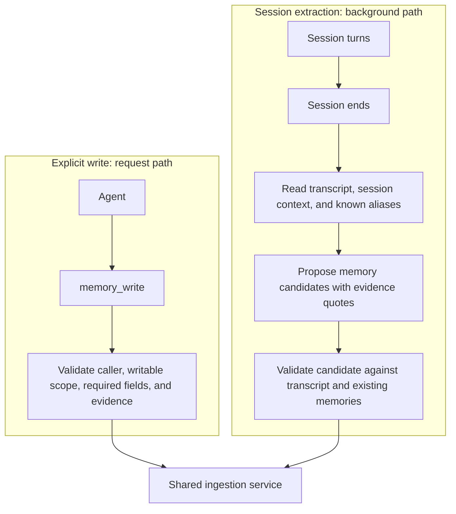
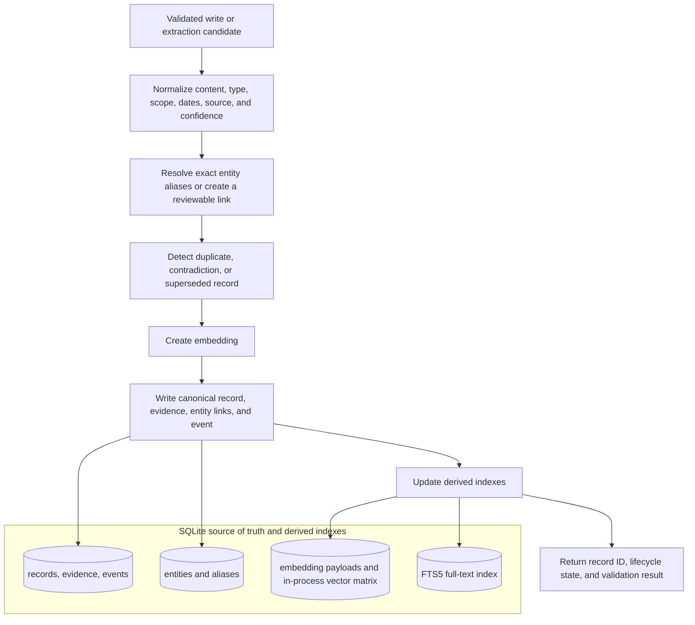
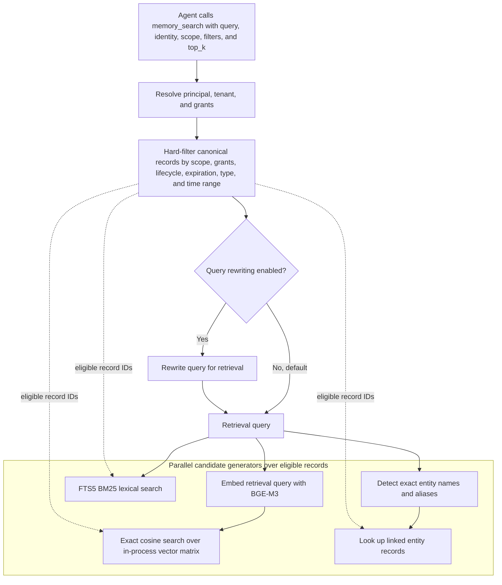
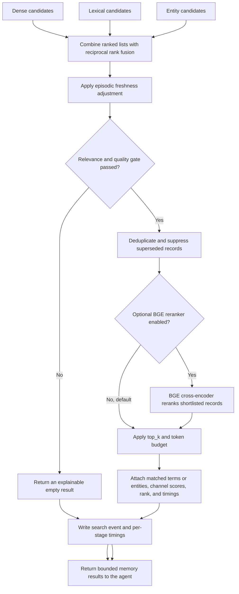

# Agent Memory System

## 1. Introduction

Agent Memory System is a provider- and framework-neutral long-term memory layer for AI agents. It stores durable facts, decisions, and dated experiences outside the conversation. Agents call explicit tools to retrieve, create, revise, or forget those records.

The implementation uses the transcript as raw material. Each record includes scope, source, evidence, lifecycle metadata, and retrieval context. The current design runs locally and remains inspectable: SQLite is the source of truth, and vector, full-text, and entity indexes derive from the same records.

## 2. Motivation and why

An LLM invocation ends with no retained state. You can replay a growing transcript for continuity in one conversation, but the approach costs tokens, complicates governance, and does not transfer knowledge across sessions or agents.

Agents need a way to retain information such as a user's preferences, a confirmed project convention, or the decision and outcome from a previous attempt. The system must scope that information, retrieve it for the right task, and let an authorized actor inspect or correct it.

## 3. Characteristics / Guarantees of the system

| Characteristic | What the system guarantees |
| --- | --- |
| Durable canonical store | SQLite holds the canonical memory record, metadata, source data, event history, vector payload, and full-text index. Search indexes can be rebuilt from it. |
| Explicit, tool-mediated access | Agents use `memory_search`, `memory_get`, `memory_write`, `memory_revise`, and `memory_forget`. The integration adds memory only after an agent calls a tool. |
| Stable prompt prefix | Integrators keep the base prompt stable for provider-side caching. An agent calls a memory tool when it needs one and receives the requested result. |
| Strict isolation | Scope, principal identity, grants, lifecycle state, expiration, and record type are hard filters before ranking. An ineligible record cannot appear in the result. |
| Source and evidence | A stored record includes its source, creator, timestamps, confidence, and supporting transcript or tool evidence. The system distinguishes a user statement from an inference. |
| Controlled lifecycle | Records can be provisional, confirmed, superseded, expired, or forgotten. Revisions preserve the reason for the change. |
| Explainable retrieval | A result carries its retrieval evidence: matched terms or entity, contributing candidate channels, score components, and the final rank. |
| Entity-aware linking | The service uses entity aliases to link records. It leaves ambiguous entities unmerged for review. |
| Model and framework neutral | The storage contract and memory tools do not depend on one model provider or agent framework. Adapters are planned for Deep Agents and CrewAI. |
| Predictable background work | An agent waits for an explicit write to complete. The service runs session extraction after the session, outside the message path. |

## 4. Ingestion Pipeline

An agent can write a memory during a session. An end-of-session extractor can also propose records from the transcript. The ingestion service validates and persists records from both routes under the same rules.

### 4.1 Write paths

### 4.2 Record validation and persistence

| Route | When it runs | What it is for |
| --- | --- | --- |
| Explicit write | During the agent's work, synchronously | The agent has a clear fact, decision, or correction worth retaining and supplies evidence for it. |
| Session extraction | After the session ends, asynchronously | The system identifies useful facts or episodes that the agent did not explicitly save. Each candidate must cite the source turn before it is stored. |

The current design excludes per-message extraction. Per-message extraction would add cost and latency to each turn while repeatedly examining incomplete context. The session-end pass reads the complete conversation and can extract one episodic summary alongside durable candidates.

## 5. Retrieval Pipeline

An agent starts retrieval by calling `memory_search`; the base prompt does not receive ambient memory. The service identifies the records available to that caller, then runs dense, lexical, and entity candidate generators in parallel over that eligible set. The relevance gate can return an empty result.

### 5.1 Access control and candidate generation

### 5.2 Ranking and result construction

The candidate generators have complementary jobs:

| Channel | Current method | Best at |
| --- | --- | --- |
| Dense | BGE-M3 query embedding plus exact cosine similarity over the in-process matrix | Semantic matches where the query and memory use different words. |
| Lexical | SQLite FTS5 with BM25 ranking | Exact terms, identifiers, error messages, commands, and code-like language. |
| Entity | Exact canonical-name and alias lookup, then linked-record lookup | People, projects, systems, repositories, and other named subjects. |

The service records timing for each stage, including candidate generation by channel, fusion, reranking, and result construction. The design includes query-rewriting and reranking switches in the pipeline, disabled by default so the team can measure value and latency before adoption.

## 6. How to use the system or integrate it into your agent

> To be detailed soon.

This section will show installation, persistence setup, tool registration, and integration examples for a standalone agent, Deep Agents, and CrewAI.

## 7. Tunable knobs & features

> To be detailed soon.

This section will document retrieval thresholds, `top_k`, token budgets, scope and lifecycle filters, embedding and reranker models, query rewriting, extraction policy, and timing instrumentation.

## 8. Code structure & explanation

> To be detailed soon.

This section will explain the package layout, the SQLite schema and indexes, memory service boundaries, adapter layer, CLI, and test strategy once the implementation is in place.

## 9. Reference documents, misc, and additional information

These documents define the design:

- [Research notes and initial design specification](agent-memory-research-notes.md)
- [Component guide with examples](COMPONENTS.md)
- [High-level design](agent-memory-hld.md)
- [Low-level design](agent-memory-lld.md)

The repository uses [Conventional Commits](https://www.conventionalcommits.org/) for commit messages. After cloning, enable the repository's commit-message hook with `git config core.hooksPath .githooks`.

This repository currently contains the research and design work. Implementation, benchmarks, and framework integration examples will be added as the design is validated.
