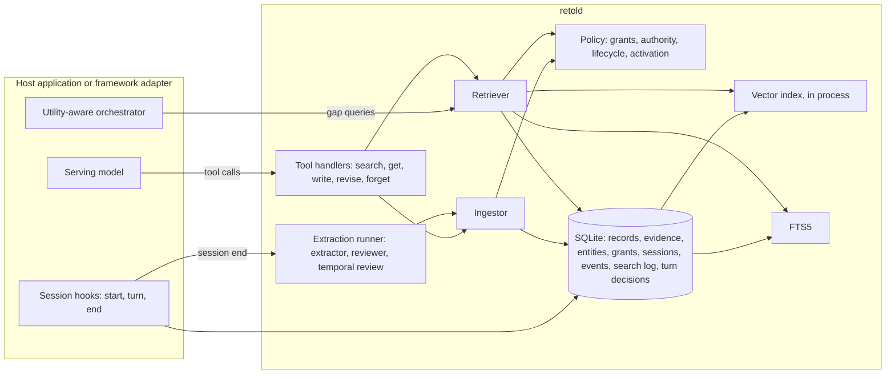

# Retold

A local, provider-neutral long-term memory layer for AI agents. It stores evidence-backed records in one SQLite file, retrieves them through dense, lexical, and entity channels fused by reciprocal-rank fusion, returns only what the caller may read, and can return nothing. Every write and every search leaves a trace that explains itself.

Documentation: https://adimyth.in/retold/. Version 1.0.1 (9 September 2026); v1.0.0 was tagged under the project's previous name, Memory Weave, and the rename changed nothing else. Python 3.12, one process, one database file. Deep Agents and CrewAI adapters ship behind extras. The utility-aware host path, which decides whether a turn needs memory before ranking anything, is implemented and validated offline; it is off by default and waits on real-traffic validation. The [acceptance report](docs/acceptance-report.md) records every gate.

## 1. What it is, and what it is not

Retold gives an agent durable memory that outlives a conversation and can be shared across agents. An agent reaches it through five tools, `memory_search`, `memory_get`, `memory_write`, `memory_revise`, and `memory_forget`, and a host reaches it through a small Python API and a CLI. Records are facts, decisions, and dated experiences about a user, a project, or an organisation, each carrying its scope, its source, a verbatim evidence quote, and its lifecycle state.

Three commitments shape everything else:

1. **A bad record is worse than a missing one.** A claim attributed to the user must be supported by a quote from the transcript that entails it, or it is downgraded to an inference that expires unless reinforced. Contradictions are resolved by source authority, never by recency alone, and the losing record is kept as lineage.
2. **An irrelevant retrieval is worse than an empty one.** Search ends with a gate that can return nothing and says why. Host-issued memory goes further: a record reaches the answer only if a judge decides it would change a draft written without it.
3. **Nothing enters the prompt prefix.** Conditional memory is appended as a tool result, so provider-side prompt caching keeps working. The one exception is a bounded ambient profile of confirmed response preferences, assembled once at session start and never edited mid-session.

It is not a vector database, a transcript replay, a knowledge graph, or a hosted service. It does not do per-message extraction, automatic entity merging, cross-user consolidation, or image and audio memory. Single process, no sharding.

## 2. Architecture



The SQLite file is the only source of truth. The in-process vector matrix and the FTS5 table are derived from it and can be rebuilt. Everything the model can see passes through the tool handlers; everything the host does passes through the hooks, the orchestrator, or the operations surface. No component calls the serving model except the host.

### 2.1 The record

Every record carries the same envelope regardless of type. The identity of a current fact is `subject_entity_id` plus `attribute`, so "Aditya's editor" is one key with one live answer and a chain of superseded rows behind it.

| Group | Fields | What it settles |
| --- | --- | --- |
| Identity | `id`, `type` (`semantic`, `episodic`, `procedural`), `version` | What kind of memory, and where in its lineage. |
| Content | `content`, `subject_entity_id`, `attribute`, `subject`, `tags` | The text the model may read and the current-fact key it answers. |
| Scope | `scope_kind`, `scope_id` | Who owns it: `agent`, `user`, `project`, or `org`. Access is a separate grant table. |
| Source | `source_kind`, `source_ref`, `creator_agent_id`, `evidence` | Where it came from and the verbatim quote that supports it. |
| Time | `created_at`, `event_at`, `expires_at`, `valid_from`, `valid_until`, `review_at` | Storage time, event time, lifecycle expiry, stated validity bounds, and a scheduled review. |
| Trust | `confidence`, `status` (`provisional`, `confirmed`, `superseded`, `expired`, `deleted`), `activation` (`conditional`, `ambient`) | Lifecycle state and whether it must pass retrieval and admission on every turn. |
| Lineage | `supersedes_id`, conflicts, `reinforcements` | What it replaced, what disagrees with it, and how often it has been seen again. |

Source kinds are ranked: `user_statement` (4) over `system` (3) over `tool_result` and `session_summary` (2) over `agent_inference` (1). A record supersedes only an equal- or lower-ranked record on the same key. A direct user or tool claim starts `confirmed`; an inference starts `provisional` and expires in 30 days unless reinforced twice.

### 2.2 Writing

Two paths, and only two.

- **Explicit write**, synchronous, during the session. The agent calls `memory_write` with a type, content, attribute, source kind, evidence, and entity mentions. The handler resolves the symbolic write target (`personal`, `current_project`) to a scope the principal may write, locates the evidence in the session transcript, checks that it entails the content with a local NLI cross-encoder, resolves entities by exact alias, compares against active records on the same key and on cosine-adjacent keys of the same entity, then reinforces, supersedes, conflicts, or creates. The FTS row, entity links, embedding, and audit event are written in the same transaction.
- **Session extraction**, asynchronous, after the session ends. An extractor model reads the whole transcript and proposes candidates with quotes; a separate reviewer model accepts, rejects, or narrows each one, and may not strengthen its source, invent evidence, or change its scope; the candidates then take the same validation and ingestion path as an explicit write. One episodic session summary is always written. Temporal expressions in the evidence may set validity bounds and a `review_at` time; a worker later flags due records without rewriting them.

Per-message extraction is deliberately absent. It charges every turn and stores guesses from an unfinished conversation.

### 2.3 Reading

`memory_search` runs the same pipeline whoever calls it:

1. Resolve the principal's readable scopes from the grant table, then hard-filter records by scope, lifecycle, expiry, type, and time window. The filter is a SQL predicate computed before any candidate exists; scope is never a ranking signal.
2. Optionally rewrite the query with current-turn context (off by default).
3. Generate up to 30 candidates from each of three channels over the eligible set: dense cosine against `bge-m3` embeddings, BM25 through FTS5 over content, subject, and entity aliases, and exact entity-alias lookup.
4. Fuse the three ranked lists with reciprocal-rank fusion (`k = 60`); apply episodic recency decay.
5. Gate: each survivor must clear an absolute floor on its own (a per-type cosine floor, or enough matched lexical terms, or an exact entity match), then survivors far below the strongest are dropped. Host-issued searches use stricter floors, exclude session summaries, and get no entity exemption.
6. Collapse near-duplicates, optionally rerank with a cross-encoder (off by default), fill `k` and a 1,500-token budget, pairing a provisional record with the confirmed record it conflicts with.
7. Return results with explanations, or an empty result with the reason the best candidate missed, and write one `search_log` row with every candidate, score, decision, and stage timing.

### 2.4 Deciding whether a turn needs memory

The relevance gate answers "is this record about the same subject as the query". It cannot answer "does this turn need remembered state": measured on a scripted conversation, ordinary turns and memory-needed turns produced overlapping score distributions at every floor ([gate.md](docs/gate.md)). The utility-aware host path answers the second question with a different mechanism:

```text
session start   -> assemble the bounded ambient profile (confirmed response preferences only)
user turn       -> draft an answer from the turn, public context, and profile
                -> in parallel, a planner names 0 to 3 information gaps the draft is missing,
                   given only a content-free inventory of the categories the store holds
                -> no gaps: serve the draft (no retrieval, no added latency)
                -> retrieve conditional candidates against the gap queries, not the turn
                -> a judge compares the candidates with the draft and admits a subset, or nothing
                -> admitted: regenerate once with the admitted records; otherwise serve the draft
```

Every stage fails closed to the draft. Every turn writes one decision row with its disposition (planner silent, retrieval miss, judge rejection, policy failure, budget exhausted, admitted) and per-stage timings. The planner carries precision, the judge carries safety, and a per-request latency budget can only shorten the path.

The components that decide (planner model and prompt, judge model and prompt, category classifier, taxonomy, inventory builder, retrieval configuration, timeouts) are hashed into a bundle. A store serves a bundle only after a passing fitness result is recorded for it; otherwise the orchestrator runs in shadow mode, deciding and logging without changing a response. One bundle is supported today, and the models in it are configuration that passed a fixed test, not a recommendation that nearby models would:

| Role | What passed | Measured alternatives |
| --- | --- | --- |
| Gap planner | `gpt-4o`, prompt `gap-v3c` | An 8B open-weight model run locally also passed. `gpt-5-nano` was unstable. |
| Admission judge | `gpt-5.4`, prompt `admission-v3` | Two other frontier judges matched its recall and each admitted a misleading record. `gpt-4o` lost implicit recall. |
| Category classifier | `gpt-4o`, `category-v2`, with deterministic form rules | |

The path is closer to TRACE-Memory's two-stage shape than to RUMS's entropy selection, and cites both; what it adds is ambient-versus-conditional activation, a content-free inventory, joint draft-relative admission, and the control plane around them. [design-contributions.md](docs/design-contributions.md) makes the comparison; [utility-aware-memory-architecture.md](docs/utility-aware-memory-architecture.md) is the specification.

### 2.5 Trigger modes

`retrieval.trigger.mode` decides who calls `memory_search`. The pipeline is identical in every mode.

| Mode | Who searches | Status |
| --- | --- | --- |
| `tool_only` | The model, through its tool. | The default and the conservative choice. Right for task agents whose work signals when memory matters. |
| `auto` | The host, once per user turn; the search tool is not registered. | An experimental control. |
| `hybrid` | Both. | The production candidate for assistants, gated on the utility-aware path proving itself on real traffic. |

Models search well when the user points at the past and poorly when a stored preference should silently shape an answer. On the scripted slice the serving model searched on zero of six turns where memory applied. That is why the host path exists; it is also why `hybrid` is not yet recommended, because only the utility-aware path keeps a per-turn host search from polluting ordinary turns.

### 2.6 Isolation

Scope answers whose memory it is; a grant answers which agent may see it. Grants do not inherit. The only implicit scope is `agent:<agent_id>/<user_id>`, private to one pair; every user, project, organisation, and plain agent scope needs a host-provisioned grant. Tool input never carries an identity or a scope id: the adapter derives the `Principal` from the run, and `memory_write` takes a symbolic target. An operation on a record the caller cannot read answers exactly as it does for a record that never existed. Measured: zero cross-principal violations on a synthetic four-user store and on the 1,074-record fixture, across every log stage, `memory_get`, and grants.

## 3. Using it

### 3.1 Install

```bash
pip install "retold[local-models]"        # or: uv add "retold[local-models]"
```

Extras: `local-models` (the bge-m3 embedder, the NLI judge, and the cross-encoder reranker; without it you supply an embedder and judge), `live` (the Anthropic and OpenAI SDKs for extraction, review, and rewriting), `deepagents`, and `crewai`. From a checkout:

```bash
uv sync --extra local-models --extra live --extra deepagents --extra crewai
```

Set `HF_HUB_OFFLINE=1` once the model cache is warm; a partial cache hangs inside the hub library instead of failing. Hosted models read `ANTHROPIC_API_KEY` or `OPENAI_API_KEY` from the environment; the runtime picks the SDK by model name, `claude-*` to Anthropic and anything else to OpenAI. The benchmark harness additionally routes `openrouter:<slug>` through OpenRouter and `local:<repo>` through a locally loaded open-weight model.

### 3.2 Wire a host

`build_runtime` is the composition root. It returns the store, embedder, vector index, judge, session buffer, ingestor, retriever, tool handlers, extraction runner, and session hooks wired together; any argument given replaces the configured piece, which is how tests and demos substitute fakes. It makes no model call and loads no weights until the first write, search, or extraction.

```python
from retold.config import load_config
from retold.host import MemoryHost
from retold.models import Scope
from retold.runtime import build_runtime
from retold.store import Store

store = Store("memory.sqlite")                       # applies migrations
host = MemoryHost(store)
host.grant("assistant", Scope(kind="user", id="aditya"), read=True, write=True)
host.provision_user("aditya", aliases=("Aditya",))    # the principal's person entity

runtime = build_runtime(load_config("config.yaml"), store)

# Session hooks, called by the adapter or by your own loop.
principal = ...                                       # Principal(agent_id, user_id, session_id, project_id)
runtime.hooks.on_session_start(principal)
principal = runtime.hooks.on_turn(principal, "user", "I prefer concise answers.")   # returns the principal to keep using
result = runtime.handlers.memory_search(principal, {"queries": ["answer style"]})
runtime.hooks.on_session_end(principal)               # hands the session to extraction exactly once
```

The handlers take the same JSON the tools take (`runtime.handlers.tool_schemas(principal)` returns the schemas with the write targets this principal may use) and return tool-safe dictionaries. A host that cannot signal session end gets an idle split after `ingestion.session_idle_timeout_minutes`.

### 3.3 Use an adapter

Both adapters wire one runtime into a framework and own nothing else: identity derivation, turn capture, tool registration, result rendering, and the host-issued search in `auto` and `hybrid`. They pass one shared contract suite and leave the same semantic records from the same conversation.

```python
from deepagents import create_deep_agent
from retold.adapters.deepagents import DeepAgentsMemoryAdapter

adapter = DeepAgentsMemoryAdapter(runtime)            # trigger_mode defaults to the config
agent = create_deep_agent(
    model=model,
    tools=adapter.tools(),
    system_prompt=adapter.system_prompt("You are a helpful assistant."),
    middleware=[adapter.middleware()],
)
agent.invoke({"messages": [...]}, {"configurable": {"thread_id": "s1", "agent_id": "assistant", "user_id": "aditya"}})
adapter.end_session(config)
```

The principal comes from `configurable.agent_id`, `user_id`, and `thread_id` at call time. The CrewAI adapter binds the principal when it is built, because CrewAI has no per-call configuration, and wraps the crew's LLM in a proxy that carries the same policy. To run the utility-aware path, pass `memory_mode="utility_aware"` with a `UtilityAwareConfig`, a gap policy, an admission policy, and a bundle registry. `examples/deepagents_demo.py` and `examples/crewai_demo.py` run the whole thing with fakes and no keys; `examples/reference_host.py` shows a host with per-stage kill switches, a metrics-driven rollback, and the bundle check.

### 3.4 Operate it

```bash
retold --store memory.sqlite migrate                       # forward-only schema migrations
retold grant assistant user:aditya --read --write
retold search --agent assistant --user aditya "answer style" --json
retold get <record_id> --agent assistant --user aditya    # lineage, conflicts, events
retold dump --scope user:aditya [--all-statuses]
retold expire | retain | review-due                        # lifecycle maintenance
retold extract <session_id> [--force]                     # run extraction through review
retold erase --user aditya --reason "request" --yes        # irreversible, compacts the file
retold reembed --model M --version V                       # refuses until the floors are recalibrated
retold snapshot save|load <path>
retold reviews list | resolve <id> --as promote --resolver R | backlog --max-open N --max-age-days D
retold metrics [--rollback-check]                          # the turn-decision log, by stage
retold bundles list | record <components.json> --passed --evidence E --by B
```

Every command takes `--store`, `--config`, and `--as` (the operator identity written to audit events). `memory_forget` is an agent tool and leaves a tombstone; erasure is an operator action.

### 3.5 Test it

```bash
uv run pytest                                                          # fakes only, no downloads
HF_HUB_OFFLINE=1 RETOLD_INTEGRATION=1 uv run --extra local-models pytest tests/integration
RETOLD_RUN_SLOW=1 uv run pytest tests/integration/test_scale.py tests/integration/test_writer_contention.py
uv run ruff check . && uv run ruff format --check . && uv run mypy      # strict
```

Unit tests never download a model. The integration suite runs the real embedder and judge on the committed 1,074-record fixture: the dense-floor sweep, warm and cold latency, and isolation. The slow suite builds a 50K-record store and runs four writers beside two extraction workers. [BENCHMARK_HANDOFF.md](BENCHMARK_HANDOFF.md) says which log columns carry which stage and what was measured.

## 4. Configuration

One YAML file, loaded by `load_config`; every value has a default and validation rejects an inconsistent file. The full reference with the reasoning behind each value is [section 2 of the low-level design](docs/agent-memory-lld.md#2-configuration). The values below are the ones an integrator is likeliest to touch.

| Key | Default | What it controls |
| --- | --- | --- |
| `store.path`, `store.busy_timeout_seconds` | `./memory.sqlite`, 30 | The database and how long a writer waits for another's lock. Every transaction begins `IMMEDIATE`. |
| `embedding.model`, `embedding.version`, `embedding.dims` | `BAAI/bge-m3`, `"1"`, 1024 | Every stored vector carries model and version; changing either is a migration (`retold reembed`) that requires recalibrating the floors. |
| `retrieval.trigger.mode` | `tool_only` | Who calls `memory_search`. `auto_k` (4) and `auto_min_query_chars` (12) bound host-issued searches. |
| `retrieval.per_generator_k`, `rrf_k`, `default_k`, `token_budget` | 30, 60, 8, 1500 | Candidates per channel, the fusion constant, results returned, and the tool-result ceiling. |
| `retrieval.gate.dense_floor.<type>` | semantic 0.45, episodic 0.40, procedural 0.45, session_summary 0.50 | The cosine a dense-only candidate must reach. Swept on the labelled fixture: 0.45 sits inside the band whose F1 is within 90 percent of the best. |
| `retrieval.gate.lexical_min_term_fraction`, `lexical_min_matched_terms`, `relative_floor`, `entity_exempt` | 0.5, 2, 0.5, true | The lexical-only floor, and the drop relative to the strongest survivor. |
| `retrieval.gate.auto.*` | stricter floors, `exclude_source_kinds: [session_summary]`, `entity_exempt: false` | The gate for host-issued searches. The entity exemption was removed after it admitted memory on 3 of 12 ordinary turns and 0 of 6 that needed it. |
| `retrieval.freshness.episodic_half_life_days`, `floor` | 30, 0.5 | Episodic decay. Semantic and procedural records do not decay. |
| `retrieval.dedup_cosine` | 0.92 | Near-duplicate collapse among survivors. |
| `retrieval.rewrite.enabled`, `model`, `timeout_ms` | false, `claude-haiku-4-5-20251001`, 800 | Query rewriting with current-turn context. Measured without benefit on gap queries; off. |
| `reranker.enabled`, `model`, `floor`, `candidates`, `mode`, `timeout_ms`, `on_failure` | false, `BAAI/bge-reranker-v2-m3`, null, 30, `rrf_cross_encoder`, 2000, `fallback` | The cross-encoder. Enabling it requires a calibrated floor. `mode` places it after the RRF floors or in place of them; a timeout or error falls back to the RRF order and is recorded in the search log. Measured in both placements; off. |
| `ingestion.evidence.min_characters`, `min_words`, `entail_floor` | 15, 3, 0.70 | What a quote must be to support a direct claim. |
| `ingestion.equivalence.model`, `entail_floor`, `contradict_floor` | `cross-encoder/nli-deberta-v3-small`, 0.70, 0.70 | The local judge that decides same, contradicts, or distinct at write time. |
| `ingestion.dedup_candidate_cosine`, `attribute_alias_cosine`, `max_entity_attributes` | 0.85, 0.80, 64 | Which existing records a write is compared against. |
| `ingestion.provisional_ttl_days`, `reinforcements_to_confirm`, `summary_ttl_days` | 30, 2, 180 | Lifecycle of inferences and session summaries. |
| `ingestion.extraction_model`, `review_model`, `extraction_timeout_ms`, `review_timeout_ms`, `extraction_max_candidates` | `claude-haiku-4-5-20251001` for both, 60000, 30000, 20 | The two hosted models in the background write path. A timeout fails the run closed. |
| `ingestion.session_idle_timeout_minutes`, `extraction_claim_timeout_minutes` | 30, 30 | The idle split for hosts without a session end, and how long a crashed worker's claim on a session lasts. |
| `policy.source_rank.*` | user_statement 4, system 3, tool_result 2, session_summary 2, agent_inference 1 | Who wins a disagreement, and the initial status and confidence. |
| `sessions.retain_days` | 90 | When `retold retain` blanks an extracted transcript. |

The utility-aware path is configured by the host that owns the model clients, not by this file: `UtilityAwareConfig` carries `gap_enabled`, `admission_mode` (`disabled` or `hosted_judge`), `shadow`, `max_gaps` (3), `max_candidates` (8), the two stage timeouts, an optional `latency_budget_ms`, and the bundle; `ProfileAssembler` takes `max_records` (8) and `token_budget` (400). The reference host uses stage timeouts of 4 s and 8 s, measured on the fitness splits.

## 5. What has been measured

Every number is from a named run; nothing here is a target.

| Claim | Evidence |
| --- | --- |
| Ordinary turns receive no memory | Utility-aware path, configuration A on two blind splits: 1 of 20 and 0 of 20 ordinary-turn injections; 0 of 20 in the shadow harness. |
| Stored facts are recalled when needed | Explicit stored-fact recall 10 of 10 and 9 of 10; implicit memory-needed recall 7 of 8 and 6 of 7. |
| Admitted records are useful | Helpful precision 19 of 20 and 17 of 17, with one disputed label adjudicated blind by an independent reviewer and the scoring corrected rather than the model. |
| Nothing unsafe is admitted or promoted | Zero placebo, misleading, private, or unsafe admissions across the suite; zero unsafe automatic promotions. |
| Failures return the baseline | Every fail-closed branch of the orchestrator is tested; the one planner timeout observed in a run served the draft. |
| No cross-principal leakage | Zero violations on the synthetic store and the 1K fixture. |
| Search is cheap | Warm `memory_search` p50 23 ms, p95 28 ms on 1K records with the real embedder; p50 74 ms, p95 78 ms on 50K records. Write p50 26 ms. |
| The similarity gate cannot decide whether a turn needs memory | Ordinary and memory-needed turns overlap at every floor; the trade is one-for-one. |
| The cross-encoder does not help here | Both placements cut weak candidates from about six per turn to under half of one, and lost the expected record from the judge's pool on one turn in five. |
| Rewriting does not help here | 2 to 5 of about 39 searches per split changed; 1.7 to 1.9 s each. |

Sources: [acceptance-report.md](docs/acceptance-report.md), [usefulness-gate.md](docs/usefulness-gate.md) sections 8c to 8p, [gate.md](docs/gate.md), [BENCHMARK_HANDOFF.md](BENCHMARK_HANDOFF.md).

Two things are known and accepted rather than fixed: a turn that shares a subject with a stored fact that does not answer it can still admit that fact through the relevance gate, and different sessions can record the same preference under different attribute slugs. Both are in [next-phases.md](docs/next-phases.md).

## 6. Layout

```text
retold/
  config.py, models.py, runtime.py, host.py, hosted.py, operations.py, cli.py
  store/      schema.sql, migrations.py, store.py
  index/      embedder.py, vector.py, reranker.py
  ingest/     ingestor.py, evidence.py, equivalence.py, entities.py, extractor.py, reviewer.py,
              extraction.py, temporal.py, session.py, prompts/
  retrieve/   retriever.py, generators.py, fusion.py, gate.py, freshness.py, dedup.py, budget.py,
              explain.py, rewrite.py, prompts/
  policy/     grants.py, lifecycle.py, prompt.py, activation.py, utility_aware.py, bundles.py, metrics.py
  tools/      schemas.py, handlers.py
  adapters/   base.py, deepagents.py, crewai.py
examples/     deepagents_demo.py, crewai_demo.py, reference_host.py, vertical_slice.py
benchmarks/   the fitness suite, scenario splits, the supported bundle manifest, saved results
tests/        unit suite with fakes; integration/ with the real models and the 1K fixture
```

## 7. Documents

Design, in reading order:

- [Components, with examples](docs/components.md)
- [High-level design](docs/agent-memory-hld.md)
- [Low-level design](docs/agent-memory-lld.md): configuration, schema, types, policy, ingestion, retrieval, tools, adapters, CLI, tests
- [Utility-aware memory architecture](docs/utility-aware-memory-architecture.md) and its [implementation plan](docs/utility-aware-memory-implementation-plan.md)
- [What is distinctive about this design](docs/design-contributions.md)

Evidence and findings:

- [Acceptance report for v1](docs/acceptance-report.md)
- [The gate, and the question it cannot answer](docs/gate.md); [usefulness, not relevance](docs/usefulness-gate.md), the experiment record
- [Vertical-slice findings](docs/vertical-slice-findings.md), [benchmark handoff](BENCHMARK_HANDOFF.md), [benchmarks/README.md](benchmarks/README.md)
- [Next phases](docs/next-phases.md), the working note with the open items

Context: [research notes](docs/agent-memory-research-notes.md) and the [Bedrock AgentCore comparison](docs/bedrock-agentcore-comparison.md). The landscape survey and the comparative benchmark plan are kept outside the repository.

## 8. References

- *Response-Aware User Memory Selection for LLM Personalization* (RUMS). ICML 2026. https://arxiv.org/abs/2604.14473
- *TRACE-Memory: Public-Conditioned Retrieval and Utility-Aware Evidence Admission for Personalized Generation.* 2026. https://arxiv.org/abs/2608.08446

Commits follow [Conventional Commits](https://www.conventionalcommits.org/). After cloning, run `git config core.hooksPath .githooks`.
