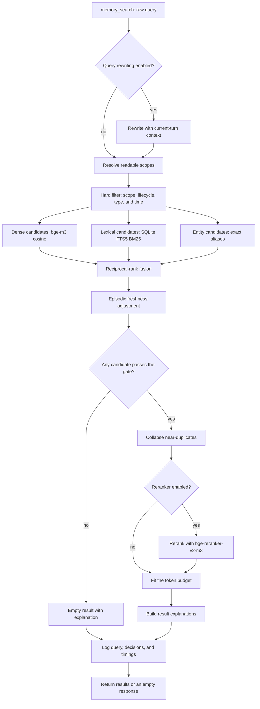

# Agent Memory System: High-Level Design

This document is the companion to `agent-memory-working-notes.md` (research questions) and `agent-memory-lld.md` (implementation detail). It records the current design decisions and why they were made; every deliberately deferred decision names the experiment that will settle it.

## 1. Goals and non-goals

### What the system must do

1. Turn interactions into durable, attributable memory records without polluting the store with guesses.
2. Return the right records to the right agent at the right moment, and return nothing when nothing applies.
3. Keep every retrieval observable: which query, which scope, which candidates, which survived, and why.
4. Stay out of the prompt prefix so prompt caching keeps working.
5. Be model-, provider-, and framework-neutral at the contract level.
6. Answer a `memory_search` call fast enough that an agent can afford to call it liberally.

### What it will not do in v1

- No image, audio, or file-content memory. Text only.
- No multi-tenant hardening, sharding, or distributed storage. Single process, single database file.
- No automatic cross-user entity merging.
- No ambient injection of memory into the system prompt.
- No self-optimizing policies (GEPA and friends come after there is a fixed contract and an evaluation set).

### Priorities, in order

1. Correctness: faithful records, correct scope, correct supersession, nothing fabricated.
2. Non-pollution: a bad record is worse than a missing one, and an irrelevant retrieval is worse than an empty one.
3. Latency: search must be cheap enough to call on most turns.
4. Everything else.

## 2. System in brief

Memory uses SQLite as its source of truth and three ways to find the same durable records: a vector index for similar meaning, SQLite FTS5 for words and identifiers, and entity links for exact identities. Agents interact with it only through five tools: `memory_search`, `memory_get`, `memory_write`, `memory_revise`, and `memory_forget`. Nothing is silently injected into the prompt. A record reaches the model only after the agent deliberately searches for it. `memory_write` and `memory_search` are synchronous tool calls; end-of-session extraction is the only asynchronous background operation.

### Store, vector index, and FTS

In RAG terms, the store is the canonical document and metadata database. The vector index and FTS index are two derived ways to retrieve candidate record ids quickly. They are part of the same local memory system, but they do not play the same role.

| Component | RAG analogy | v1 design |
| --- | --- | --- |
| Store | The canonical document store plus metadata database. | SQLite persists records, scopes, provenance, lifecycle state, entity links, events, logs, and each record's embedding blob. It is the source of truth. |
| Vector index | The vector-retrieval part of a vector database. | An in-memory matrix and record-id map loaded from SQLite's embedding blobs at startup. It performs exact cosine search and can be rebuilt from the store. |
| FTS index | A lexical or keyword retriever, similar to BM25 in a hybrid RAG pipeline. | A SQLite FTS5 virtual table containing record content, subject, and entity aliases. SQLite queries it in the same process; it is not a separate search service. |

On a write, the system persists the record and embedding in SQLite, updates FTS5 and entity links, then updates the in-memory vector matrix. On startup, it rebuilds that matrix from the stored embeddings.

### How memory enters the store

There are only two write paths.

1. An agent deliberately saves something now. For example, after the user says, “I prefer concise answers,” the agent calls `memory_write`, supplies that quote as evidence, and asks to create a semantic preference record. The tool checks that the agent may write to the intended scope, checks for duplicates or contradictions, assigns a status, embeds the text, and returns the new record id.
2. At the end of a session, a separate extraction model rereads the transcript and suggests possible memories: facts, decisions, outcomes, and an episodic summary of what happened. Every suggestion must carry an exact supporting quote from the transcript. The system does not save suggestions blindly: it verifies the quote exists, checks whether the record already exists, checks whether it contradicts a stronger or newer record, then saves it with the appropriate status.

The source controls the initial status. A direct, evidenced user statement, trusted system fact, or tool result is confirmed. A conclusion drawn by an agent or extractor is provisional. A provisional record is useful but treated cautiously: it expires after 30 days unless later evidence reinforces it. The system always writes one episodic session summary at session end, even if no durable fact is extracted.

### How memory is recalled

When an agent calls `memory_search`, the system follows the same sequence every time. Dense, lexical, and entity candidate generation run in parallel inside that one synchronous call; the tool returns only after the pipeline has produced its final results or an empty response.

1. It optionally rewrites the raw retrieval request into a standalone search query. This stage is specified for the demo but disabled by default in v1. When enabled, it receives only the raw query and host-supplied current-turn context, never memory candidates; it logs both the raw and rewritten queries.
2. It removes records the agent is not allowed to see, records that have expired or been superseded, and records outside any requested type or time window.
3. It finds candidates in parallel with three methods: dense search for similar meaning, lexical search for matching words and identifiers, and exact entity search for known people, projects, repositories, or organizations.
4. It combines the three ranked candidate lists with reciprocal-rank fusion, which rewards a record that appears near the top of one or several lists without pretending that cosine and BM25 scores are on the same scale.
5. It gives episodic records a recency adjustment, then returns no memory at all if every candidate is weak and no exact entity match exists.
6. It collapses near-duplicates, optionally reranks the survivors, and returns only as much information as fits the context budget. It logs every decision so the result can be explained later.

For v1, dense retrieval uses cosine similarity over `bge-m3` dense embeddings in the in-memory vector matrix. Lexical retrieval uses SQLite FTS5 with BM25 over `content`, `subject`, and entity aliases. Entity retrieval uses exact alias matches within an authorized scope, ordered by recency; it does not do fuzzy entity resolution or automatic entity merges. The optional reranker is `bge-reranker-v2-m3`. It is specified for the demo but disabled by default; the initial budget is an additional 100 ms mean latency for 30 candidates on the target laptop, with actual p50 and p95 measurements replacing that estimate.

## 3. Memory types and how each is treated

The four CoALA categories are used as engineering categories with different rules. Working memory is not stored by this system; the host framework owns the live conversation. The memory layer stores the other three.

| Type | Stored as | Who can create it | Decays? | Retrieved by | Example |
| --- | --- | --- | --- | --- |
| Semantic | A short declarative statement about a subject, plus entity links. | An agent recording an evidenced user statement, a trusted system or tool fact, a session extractor with evidence, or an explicit agent inference. The source and evidence determine its status. | No. Superseded by newer statements about the same subject. Provisional ones expire if never reinforced. | Dense, lexical, and entity. | “The user prefers concise technical answers.” |
| Episodic | A dated account of what happened, what was decided, and why, with an event time. | The end-of-session extractor, which always writes a session summary and may write notable decisions, or an agent explicitly recording a meaningful event. | Yes. Recency weighting on event time. Never superseded, only appended. | Dense and lexical, with time filters. | “On 3 September, the team chose SQLite for v1 because the system is single-process.” |
| Procedural | A named, versioned procedure: when it applies, the steps, and known pitfalls. | A human author, or an agent explicitly recording a reusable lesson after a task succeeds or fails. Automatic promotion from episodes is not allowed in v1. | No. Versioned. A new version supersedes the old. | Lexical on name and trigger, dense on description. | “When changing the embedding model, re-embed the store and recalibrate retrieval gates.” |

Decision: procedural memory is stored but kept small in v1. Automatic promotion of episodes into procedures is out of scope. The agent can write a procedure explicitly, and the evaluation will test whether it retrieves and follows it.

Decision: v1 has no hot, always-present durable-memory tier. Semantic facts are durable, but they are still external and tool-retrieved rather than prompt-resident. A bounded user or project profile block is a deferred experiment because it could reduce missed searches but could also create stale context, over-personalization, and a less stable prompt prefix.

## 4. The durable record

Every record, regardless of type, carries the same envelope. The content varies by type; the envelope does not.

| Field group | Fields | Meaning | Example |
| --- | --- | --- |
| Identity | `id`, `type`, `version` | Identifies the record, its memory category, and its revision in a lineage. | `mem_0142`, `semantic`, version `2` |
| Content | `content`, `subject` | Holds the text the model may read and a normalized topic used for duplicate and contradiction checks. | Content: “The user prefers concise technical answers.” Subject: “answer-detail preference” |
| Scope | `scope_kind`, `scope_id` | States who owns the memory. The separate grant table determines which agents may access that scope. | `user`, `user_123` |
| Provenance | `source_kind`, `source_ref`, `creator_agent_id`, `evidence` | States what supports the record, where that support can be found, and which agent created it. `evidence` is a verbatim source quote. | `user_statement`, `session_456`, `research_agent`, “Please keep answers concise.” |
| Time | `created_at`, `event_at`, `expires_at` | Separates when the system stored a record, when the underlying event occurred, and when the record should stop being normally retrievable. | Created 4 September; event 3 September; no expiry for a confirmed preference |
| Trust | `confidence`, `status` | States how strongly the system should trust the record and whether it is active, provisional, superseded, expired, or deleted. | Confidence `0.95`; status `confirmed` |
| Lineage | `supersedes_id`, `conflicts_with` | Connects a changed fact to the record it replaces and identifies records that disagree. | Supersedes `mem_0091`, which said the user preferred detailed answers |
| Links | entity links, tags | Supplies explicit handles for exact identity matching and useful filtering. | Linked to the `person:user_123` entity; tag `communication-preference` |

Source kinds are ranked. A record can only supersede a record of equal or lower source rank.

| Rank | `source_kind` | Meaning | Initial status |
| --- | --- | --- | --- |
| 4 | `user_statement` | The user said it explicitly. | confirmed |
| 3 | `system` | Injected by the host application from an authoritative store. | confirmed |
| 2 | `tool_result` | Observed from a tool output. | confirmed |
| 1 | `agent_inference` | The agent or extractor concluded it. | provisional |

Lifecycle states: `provisional`, `confirmed`, `superseded`, `expired`, `deleted`. Only `provisional` and `confirmed` are retrievable by default. Superseded and expired records stay in the database for audit and can be requested explicitly. Deleted records are tombstoned; content is removed only when a user asks for deletion.

## 5. Scope and access

Scope answers "whose memory is this". Access answers "which agent may see it". They are separate.

Scope kinds, from narrowest to broadest: `agent`, `user`, `project`, `org`. A record has exactly one scope.

Access is a grant table: which agent id may read or write which scope. An agent always has read and write on its own `agent` scope. Everything else must be granted. Every `memory_search` request carries the requesting agent id and the principal user id; the pipeline computes the set of readable scopes before any candidate generation runs. Scope filtering is a hard SQL predicate, never a ranking signal.

Decision: no scope inheritance in v1. A user grant does not imply a project grant. This is more typing and less clever, and it makes the leakage tests trivial to reason about.

## 6. Ingestion

Two write paths, and only two.

### Path A: explicit agent write

The agent calls `memory_write` with a type, content, subject, scope, and source kind. The tool validates scope permission, runs dedup and contradiction checks against the store, sets the initial status from the source kind, embeds the content, and returns the record id. Synchronous. This is how an agent records a decision it just made, a user preference it was just told, or a procedure it just learned.

The agent cannot claim `user_statement` without an `evidence` quote that the tool can locate in the current session transcript. Without it, the source kind is downgraded to `agent_inference`.

### Path B: session extraction

When the host framework signals session end, the extractor reads the full transcript and proposes candidate records. Each candidate must include a verbatim evidence span. The validator:

1. Rejects any candidate whose evidence span is not found in the transcript.
2. Rejects candidates that are near-duplicates of existing records (reinforces the existing record instead).
3. Detects contradictions with existing records on the same subject and applies the supersession rule.
4. Assigns status from source kind.
5. Writes an episodic session summary record regardless of whether any facts were extracted.

Extraction is asynchronous and has no latency budget. It uses a separate, cheap structured-output model, not the serving model.

Decision: no per-message extraction in v1. It multiplies cost and, more importantly, multiplies the chance a half-formed inference becomes durable. Session-end extraction plus explicit agent writes covers the cases we care about, and the evaluation will show what it misses.

### Reinforcement and expiry

A provisional record expires 30 days after creation unless reinforced. Reinforcement happens when a later extraction produces the same fact again, when the agent revises it, or when a user confirms it. Reinforcement raises confidence and extends expiry. Two independent observations promote a provisional record to confirmed.

## 7. Retrieval

Section 2 gives the plain-language overview. This section records the fixed pipeline and the decisions that make it safe and inspectable.

The scope filter runs before any candidate generator. Dense, lexical, and entity search run in parallel inside the same synchronous tool call, with up to 30 candidates each. The gate can return nothing; the reranker is optional and disabled by default; the final context budget is 1,500 tokens.

### Decisions that matter

**The agent decides to search; retrieval owns optional query rewriting.** The agent sends a raw retrieval request and may provide entity hints. A query-rewrite stage belongs inside the retrieval pipeline because it is a retrieval concern, not a burden on the serving agent. It is specified behind a feature flag but disabled by default in v1. When enabled, it rewrites from the raw request and the host-supplied current-turn context into a standalone search query. It never sees candidate memories before searching, and both forms of the query are logged. The evaluation compares raw and rewritten queries on follow-up-question cases before we make rewriting a default.

**Fusion by rank, not score.** Cosine similarity, BM25, and recency have incomparable scales. Reciprocal rank fusion avoids calibrating them against each other, and it degrades gracefully when one generator returns nothing.

**Empty is a first-class answer.** The gate returns no results when the best candidate is weak on every signal: below the cosine floor on dense, below the BM25 floor on lexical, and not an entity match. The floors are configuration values, calibrated on the evaluation set and re-calibrated whenever the embedding model changes.

**A reranker is specified but disabled by default.** The demo will include `bge-reranker-v2-m3` behind a feature flag. It reranks the surviving candidates after duplicate collapse, rather than the whole store. For 30 candidates, the initial performance budget is an additional 100 ms mean latency on the target laptop; the benchmark must report the real p50 and p95 by candidate count and hardware. It becomes the default only if it improves the final records entering context and downstream task outcomes enough to earn that cost.

**Results carry explanations.** Each returned record includes an explanation object containing the raw and, if enabled, rewritten query; the generators that matched it; its rank and score from each generator; fused rank; any freshness adjustment; whether reranking changed its rank; its source kind, status, dates, and entity links; and why it survived the gate, duplicate collapse, and token budget. The response-level explanation also records why a search returned nothing. The agent can reject a record on that basis, and the user can inspect it.

### Prompt policy

All durable memory remains external to the prompt prefix. The prefix contains system instructions, tool definitions, and a short memory-use policy; the agent must still decide when to search. This is the tool-mediated policy described in Section 3, and the evaluation set measures search, no-search, and reject cases directly.

## 8. Entities

Entities are a modelling layer over records, not a fifth memory type. An entity has a kind (`person`, `project`, `org`, `repo`, `product`, `other`), a canonical name, a scope, and a set of aliases. Records link to entities through a join table.

Decision: entity resolution in v1 is exact alias match within scope, nothing fuzzier. An extractor that mentions "Aditya" links to the `person` entity with that alias in a readable scope, or creates a new provisional entity in the writer's scope if none exists. There is no automatic merge of two entities. Merges are an explicit `memory_revise` operation with an audit event. A false merge is the worst failure the system can have, so it is not automated.

## 9. Components

| Component | Responsibility | Talks to |
| --- | --- | --- |
| Store | The SQLite source of truth: schema, migrations, durable records, embedding blobs, FTS5, entity links, grants, and logs. | Everything. |
| Vector index | A rebuildable in-memory projection of active SQLite embedding blobs. It maps record ids to vectors and performs exact cosine search with id filtering. | Store, Retriever, Ingestor. |
| Embedder | Turns text into vectors. Versioned. One model per index. | Vector index. |
| Ingestor | Validates and writes records. Dedup, contradiction, supersession, entity linking. | Store, Vector index, Embedder, Extractor. |
| Extractor | Reads a transcript and proposes candidates with evidence. A structured-output model behind an interface. | Ingestor. |
| Retriever | Runs the search pipeline. | Store, Vector index, Embedder, optional Reranker. |
| Policy | Resolves grants, source ranks, expiry rules, thresholds. Pure functions over config. | Ingestor, Retriever. |
| Tool surface | The five tools as plain JSON-schema definitions plus handlers. | Retriever, Ingestor. |
| Adapters | Translate a framework's tool and session model to the tool surface and ingestion hooks. One per framework. | Tool surface, host framework. |
| Log | Records every write, search, and lifecycle change. The evaluation harness reads this. | Store. |

## 10. Model choices

| Role | Default | Why | Alternative |
| --- | --- | --- | --- |
| Embedding | `bge-m3`, dense head only, 1024 dims, run locally | Open, multilingual, strong on short declarative text, no network call in the search path. | `nomic-embed-text-v1.5` for a smaller footprint. Any hosted embedding through the same interface. |
| Extraction | A small hosted model with reliable structured output (Claude Haiku 4.5 or equivalent) | Extraction runs off the hot path; quality of evidence-grounded output matters more than speed. | A local instruction-tuned model. |
| Reranker | `bge-reranker-v2-m3`, planned behind a disabled feature flag | Same family as the embedder; small enough to run locally. Its initial budget is an additional 100 ms mean latency for 30 candidates, to be replaced by benchmark data. | None. |
| Serving | Whatever the host framework uses | The memory layer never calls the serving model. | n/a |

Every embedding row stores the model name and version. Changing the embedder is a migration that re-embeds the whole store and re-calibrates the gate floors. It is never silent.

## 11. Latency budget

Targets on a laptop, single process, store of up to 50K records.

| Operation | Target p50 | Target p95 | Notes |
| --- | --- | --- | --- |
| `memory_search`, no reranker | 40 ms | 120 ms | Embedding the query dominates. Keep the embedder warm. |
| `memory_search`, with reranker | 150 ms | 400 ms | Reranker on 30 candidates. |
| `memory_get` | 2 ms | 10 ms | Primary key lookup. |
| `memory_write` | 60 ms | 150 ms | Embed plus dedup search plus insert. |
| Session extraction | none | none | Asynchronous. |

The in-memory vector matrix and same-process SQLite FTS5 queries are what make these numbers possible. A network hop to a separate vector database would consume much of the budget on its own.

These are design targets, not claimed measurements. The benchmark establishes actual values before we call them performance characteristics.

### Per-stage benchmark instrumentation

Every benchmark run records total latency, p50, p95, mean, corpus size, candidate count, model version, feature-flag configuration, and whether the process was cold or warm. It must also break the operations down into the stages below.

| Operation | Timed stages |
| --- | --- |
| `memory_search` | Optional query rewrite; readable-scope resolution; hard filter construction; query embedding; dense candidate generation; FTS5 BM25 candidate generation; entity lookup; reciprocal-rank fusion; episodic freshness adjustment; empty-result gate; duplicate collapse; optional reranking; token-budget assembly; response explanation assembly; log write. |
| `memory_write` | Permission check; evidence validation; duplicate search; contradiction and supersession check; entity link resolution; content embedding; vector-index update; SQLite transaction; event-log write. |
| Session extraction | Transcript preparation; extractor-model latency; candidate validation; duplicate and contradiction checks; each accepted write; session-summary write. |

The benchmark report must show dense, lexical, entity, and reranker timing independently, not only end-to-end search time. It must also measure how their latency changes with store size and how reranker latency changes with its candidate count.

## 12. Framework neutrality

The contract is the record envelope, the scope and grant model, the tool schemas, and the ingestion events (`session_started`, `turn_completed`, `session_ended`). Adapters own everything framework-specific: how tools are registered, how agent and user ids are recovered from the run context, and how tool results are formatted for the model.

Decision: the first two adapters are Deep Agents and CrewAI, as the research notes specify. They differ enough in session and identity handling that a contract surviving both is evidence of neutrality. The adapters are part of the experiment.

## 13. Observability

Every search writes one log row: raw request; rewritten query and rewrite status when applicable; resolved scopes; per-generator candidate ids, ranks, and scores; fused ranking; freshness adjustment; gate decision; dropped duplicates; reranker changes; final ids; result explanations; and per-stage latency. An empty result records why no candidate passed the gate. Every write logs the candidate, validation outcome, status, any supersession, and per-stage latency. The evaluation harness is a reader of this log. If a behaviour cannot be reconstructed from the log, the log is incomplete and that is a bug.

## 14. Failure modes and their defences

| Failure | Defence |
| --- | --- |
| Agent guess becomes a durable fact. | Source rank. Inferences start provisional and expire unless reinforced. |
| Record leaks across users or agents. | Scope is a hard filter computed from the grant table before any retrieval. Tested with adversarial cases. |
| Stale fact returned after the user changed their mind. | Supersession on subject. Superseded records excluded from default retrieval. |
| Irrelevant memory distracts the model. | Gate with calibrated floors. Token budget. Explanations let the agent reject results. |
| Two people merged into one entity. | No automatic merge. Exact alias resolution only. |
| Prompt cache broken by memory. | Nothing from the store enters the prefix. |
| Agent never searches. | Measured directly by the evaluation. The memory-use policy in the prefix is the lever; it is a prompt, not a system change. |
| Embedding model swap silently changes behaviour. | Model version on every embedding row. Swap is a migration with re-calibration. |

## 15. Decisions deferred to experiments

| Question | Default in v1 | Experiment that settles it |
| --- | --- | --- |
| Does query rewriting help? | Rewrite stage planned but disabled. | Compare raw and rewritten query recall on the follow-up-question cases. |
| Does the reranker earn its latency? | Off. | Compare final-context precision with and without. |
| Are the gate floors right? | Calibrated once on the eval set. | Sweep floors against the no-memory cases. |
| Is per-message extraction worth it? | Session-end only. | Compare recall of mid-session facts against pollution rate. |
| Should anything be ambient? | Nothing. | Add a bounded user profile block; measure search-miss rate against over-personalization. |
| Exact vs approximate vector search? | Exact. | Only revisit above 200K records. |

## 16. What the evaluation will need from this design

The benchmark work comes later, but the design is shaped so it can be built. The log gives the harness every intermediate decision. The store can be snapshotted and restored, so scenarios start from a known state. The tool surface can be driven directly without an agent for retrieval-only tests, and through an adapter for end-to-end tests. Scenario categories the design anticipates: desired write, prohibited write, desired retrieval, prohibited retrieval, stale record, conflicting records, entity ambiguity, cross-scope boundary, search versus no-search, and downstream task effect.
