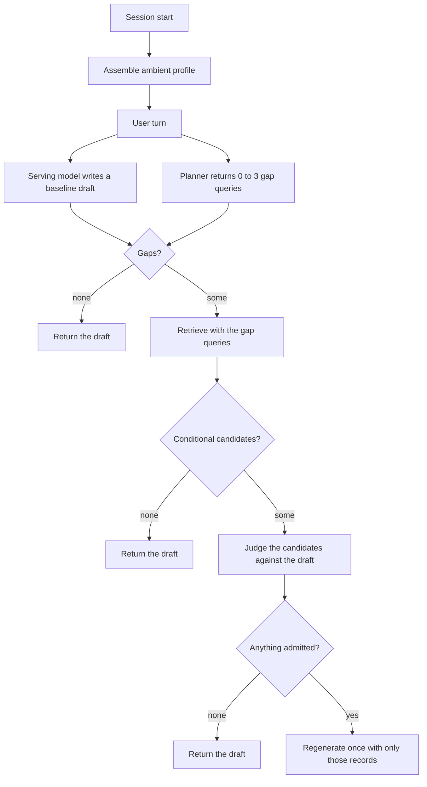

# What is distinctive about this design

A plain-language account of the design choices that look distinctive relative to RUMS and TRACE-Memory. The authoritative specification is [utility-aware-memory-architecture.md](utility-aware-memory-architecture.md). Experiment numbers live in [usefulness-gate.md](usefulness-gate.md).

These are design contributions that appear distinctive relative to those two papers. Calling them academically novel would require a broader systematic literature and prior-art review.

The strongest claim is therefore not “we invented utility-aware memory.” Both RUMS and TRACE-Memory clearly precede that claim, and they are not the same idea as each other either. The defensible contribution is a governed, provider-neutral architecture for deploying utility-aware memory, with separate ambient activation, content-free gap conditioning, draft-relative joint admission, and bundle-level safety validation.

## 1. Memory is split by when it should show up

Most memory systems treat every stored fact the same: retrieve it if it looks relevant.

Memory Weave does not. It has two kinds of memory:

- **Ambient** — standing facts that should quietly shape many answers. Example: “I write tests in pytest” or “reply in English.” You should not have to re-prove that every turn.
- **Conditional** — facts that are only worth injecting if they actually help this turn. Example: “Rohan left Nimbus in April.” That only matters when Rohan or Nimbus is relevant.

RUMS and TRACE-Memory both ask a form of “does this memory help the answer?” That is a good question for one-off facts. It is a bad question for style. The experiments showed that: when language and style preferences had to pass the same “prove you are useful this turn” gate, they almost never made it in. The planner never asked for them, because nobody says “how should you answer?”

The split is the fix: some memory is always on; some memory has to earn its way in.

## 2. A memory cannot promote itself to always on

Ambient is powerful. If a record sits in the profile every turn, a wrong promotion leaks into everything.

So the system does not let a model say “this is ambient” and make it so. Promotion has rules:

- Find the user’s own words in the transcript, not a paraphrase the model invented.
- Standing defaults (“I always…”, “by default…”) can become ambient.
- Scoped ones (“for SQL queries…”) stay conditional.
- Temporary ones (“just for this PR…”) never become ambient.
- Ambiguous cases go to a human review queue (`memory-weave reviews list` / `reviews resolve`). The record stays conditional until a person resolves it.
- High classifier confidence is not enough by itself. Confidence can send an unclear case to review; it cannot vote a record into the always-on profile.

That is a state change with a gate, not retrieval. Retrieval is “find this fact.” This is “change how this fact is allowed to behave from now on.”

## 3. The planner sees a catalog, not the secrets

Before retrieval, a planner decides: “Does this question need private memory at all?”

If you show the planner the actual stored facts, you have already leaked them. If you show it nothing, it only notices questions that sound personal (“my”, “our”, “we”). The experiments hit that: organisation-specific questions with no possessive pronouns were skipped.

The inventory is a table of contents without the pages: “this user has facts in: people, decisions, on-call, code style.” The planner can think “this sounds like an org-decision question, and we do store decisions” without seeing the decision itself.

TRACE-Memory already has “ask for missing user-specific info.” The extra piece here is the prior question: how does the planner know what kinds of private info might exist, without being shown that info?

### Do other systems have this?

Several systems have something that *looks* like a table of contents. None of them is a content-free category inventory used to decide whether to search.

| System | What the model can see before it reads a memory | What leaks |
| --- | --- | --- |
| Letta (MemFS) | The file tree under `system/` is in the prompt every turn. The agent then reads files on demand. | File names. `Rohan.md` already says there is a person named Rohan. |
| Claude Code, Hermes, OpenClaw | A hot slice of markdown files, or the agent can list the memory directory. | File names and whatever sits in the hot slice. |
| LangMem | Namespace folder paths such as `users/aditya/prefs`. Search returns the JSON values. | Paths if the host or agent lists them; values on search. |
| ChatGPT / Claude chat | The profile paragraph itself, every turn. | The facts, not a catalog of them. |
| Mem0, Zep, AgentCore | Nothing catalog-like. Search returns the records. | The hits. |

A directory listing is a table of contents of *artifacts*. Memory Weave’s inventory is a table of contents of *fact kinds*: `people and their roles`, `runtime and version constraints`, `document and repository locations`. No file names, no sentences, no values.

That is the difference that matters for the planner. “We store version constraints” tells it that “What Node version is staging on?” might need a lookup. It does not tell it that Node is pinned to 20.

### Who creates the inventory?

Not the planner, and not as a separate “write a table of contents” step at turn time.

1. When a record is written, the **category classifier** assigns it a `retrieval_category` from a fixed taxonomy (`time_zone`, `people`, `constraints`, and so on).
2. The store keeps that label on the record.
3. At turn time, `inventory()` asks the store for the distinct categories of the principal’s **conditional** records and maps them to human labels. Record text never enters that list.

The classifier labels each page. The inventory is the unique chapter titles. Changing the classifier or the taxonomy changes the catalog the planner sees, which is why both are part of the versioned bundle.

## 4. Planner, judge, and admission are two roles, not three

There is no separate “admisser.” The **judge is the admission policy**.

| Role | Code name | Question it answers | What it sees | What it must not see |
| --- | --- | --- | --- | --- |
| **Planner** | `GapPolicy` | “Might this turn need private facts at all? If so, what should we search for?” | The user message, public context, ambient profile, category inventory | The stored fact text |
| **Retriever** | existing hybrid search | “Which conditional records match those search queries?” | The gap queries | — |
| **Judge** | `AdmissionPolicy` | “Would any of these records improve the draft we already have?” | The request, public context, ambient profile, baseline draft, candidate records | — |

A fourth model, the **category classifier**, runs at write time. It is not on the turn path.

They felt similar because both planner and judge are hosted LLM calls that can return empty. They are opposite filters. The planner decides whether to look; the judge decides whether looking found anything worth using.

### Turn flow



Walkthrough for “What Node version is staging on?”

1. Session start already put style and language preferences into the ambient profile. They are in the baseline. They are not candidates.
2. The serving model writes a generic draft from public knowledge plus that profile.
3. In parallel, the planner sees the inventory containing `runtime and version constraints` and emits a gap such as “which Node version this org is pinned to.” It still has not seen the pin.
4. The retriever searches on that gap query, not on the raw turn, and returns a small candidate set.
5. The judge compares those candidates with the generic draft. If the pin would change the answer, it admits that record. If the draft is already sufficient, it admits nothing.
6. Only then does the serving model write the user-visible answer, and only with the admitted facts.

If the planner stays silent, if search misses, if the judge rejects, or if a timeout or budget fires, the user still gets the baseline draft. Those four outcomes look the same from outside and are logged as different events.

## 5. Useful means better than the answer we already have

Relevance is “this fact is about the topic.” Utility is “this fact would change the draft.”

The judge sees:

- the user’s question
- public context
- the always-on (ambient) profile
- the draft the model would already give
- a small set of candidate memories

Then it asks: would any of these candidates improve that specific draft?

That makes redundancy real. A fact can be on-topic and still useless, because the baseline answer is already good enough. TRACE-Memory has the closest research form of this: admit evidence only if it improves the response beyond public context. Memory Weave’s version is a runtime judge that looks at the actual draft, without needing TRACE-Memory’s trained admission model.

## 6. Candidates are judged as a group, and using nothing is a valid win

The judge does not score each memory in isolation and take the winners. It looks at the set together and can say:

- this one
- these two together
- none of them

Why the set matters: two records can be complementary. Independently, each looks weak. Together they complete the answer. Independent scoring would drop both.

Why “none” matters: not injecting memory is often the correct outcome on an ordinary turn. It is not a retrieval failure. The system is allowed to withhold.

TRACE-Memory also allows compact subsets and the empty set. What is distinctive here is wiring that into draft-relative judgment, the existing retriever, budgets, and failure isolation — not inventing the empty action itself.

## 7. “No memory used” is not one event

From the outside, many turns look identical: the user got an answer with no extra memory injected.

Internally those can be six different things:

| Cause | Meaning |
| --- | --- |
| Planner silence | The planner never asked for memory |
| Retrieval miss | It asked, but search found nothing |
| Judge rejection | Search found candidates; the judge said they would not help |
| Policy failure | Something in the policy path broke |
| Budget withholding | Time or cost budget cut the path short |
| Successful admission | Memory was used |

That logging is why early “zero injection” results were interpretable. They were all planner silence. The judge had never even been reached on ordinary turns, so judge precision on those turns had not yet been measured. Without stage labels, it would have looked as if the whole system were conservative. It wasn’t: one stage was never firing.

## 8. Prompts, models, and settings are one versioned product

A memory system is not just code. It is a bundle: which models, which prompts, which category taxonomy, how inventory is built, how retrieval is configured, what the budgets are.

Change any piece and you have a new configuration. That new hash:

- invalidates the old fitness score
- must re-run the fitness suite against the committed scenario sets
- must pass shadow evaluation before it serves live traffic

You would not ship model weights because someone edited a YAML file by hand. This treats prompts and routing the same way: they are release artifacts, not informal knobs.

### One combination that passed

This is the combination that passed the fifth-split fitness bar, then the later suite, and is recorded as `benchmarks/bundles/bundle-2026-09-08-a.json`. It is a measured snapshot, not a claim that nearby swaps will behave the same.

| Piece | What passed |
| --- | --- |
| Planner | `gpt-4o` with the inventory-aware gap prompt (`gap-v3` in the Phase 0 runner; `gap-v3c` in the served orchestrator, which adds a structured category on each gap) |
| Judge | `gpt-5.4` with the decision-impact admission prompt (`admission-v3`) |
| Serving / drafts | `gpt-5.6-luna` in the Phase 0 runs |
| Classifier | `gpt-4o` / `category-v2`, with deterministic form rules on top |
| Taxonomy | `activation-v2-frozen` |
| Inventory | store-generated category labels (`inventory-v1`) |
| Retrieval | real hybrid retriever on the later splits |

`gpt-4o` is the hosted planner that passed. It is still a full hosted chat model. An 8B open-weight model also passed the planner role, which is the actually cheaper planner option that was measured. Do not read “planner can be `gpt-4o`” as “the planner is inexpensive.”

Tried and rejected on the same tests: `gpt-5-nano` as planner or judge; `gpt-4o` as judge on the full measurement; a gap-anchored judge; style and language preferences left conditional.

Tweaking any row in the table is a new combination. It needs a fresh pass on the fitness bar before it is treated as supported. Nearby models and prompt edits have already failed that bar while looking interchangeable on easier splits.

### How to tell whether a combination works

```bash
# Live run against the committed fifth-split scenario, with the combination that passed as the default.
HF_HUB_OFFLINE=1 uv run --extra live --extra local-models python benchmarks/evaluate_combination.py \
  --gap-model gpt-4o --admission-model gpt-5.4

# Score a saved phase0 result without calling models.
uv run python benchmarks/evaluate_combination.py --from-result benchmarks/results/phase0/<file>.json
```

The script prints `PASS` or `FAIL` per threshold (ordinary injection, explicit recall, implicit recall, unsafe admissions, and promotion checks when activation is real) and a final `COMBINATION PASS` or `COMBINATION FAIL`. It exits 1 on failure. Those thresholds are the fifth-split bar: ordinary injection at most 5%, explicit recall at least 90%, implicit recall at least 75%, nothing unsafe, and when activation is real every eligible preference promoted, nothing unsafe promoted, scoped preferences kept conditional.

## 9. Models are not interchangeable, even if the APIs are

The code can talk to multiple providers. That does not mean any model can sit in any role.

The measurements said:

- the planner role passed on `gpt-4o` and on an 8B open-weight model run locally
- a model that finds the right memories can still be an unsafe judge (several admitted a misleading record)
- “provider-neutral” is about interfaces, not “swap GPT for anyone and keep the same safety”

The architecture is asymmetric on purpose: planner and judge are different jobs, certified separately, as measured bundles.

## 10. If anything goes wrong, keep the baseline answer

Conditional memory is optional. The answer the model would have given without it is the safe default.

If gap planning fails, retrieval times out, the judge output cannot be parsed, or the budget is exceeded: do not inject. Serve the baseline.

The new subsystem can fail without poisoning the response. Conditional memory has to earn the right to change what the user sees. Withholding is the defined failure mode, not a crash and not a guessed injection.

## 11. The research idea became a control system you can actually run

RUMS and TRACE-Memory are different papers in the same family: do not inject memory because it is relevant; inject it only if it changes the answer. They operationalize that family differently, and Memory Weave operationalizes a third serving shape around TRACE-Memory’s two stages. See the table below.

What was built around those ideas is the operational machinery the experiments showed was actually needed:

- ambient vs conditional
- audited promotion
- content-free inventories
- draft-relative joint admission
- shadow isolation (try a policy without serving it)
- stage-specific diagnostics
- bundle certification
- kill switches
- review backlog
- fail-closed (withhold) semantics

## 12. What Memory Weave did differently from RUMS and TRACE-Memory

RUMS and TRACE-Memory are not the same idea. Both refuse “retrieve by similarity and inject the hits.” After that they diverge.

RUMS asks: given memories we already have, which subset reduces the model’s uncertainty about its next response? That is entropy reduction over a candidate set, and it needs access to the model’s logits.

TRACE-Memory asks: given the question and public context, what user-specific information is missing, retrieve for those gaps, then admit evidence only if it improves the answer beyond the public-only path. That is two stages, missing-information retrieval plus incremental response utility, and its training needs logprobs even though inference can be text-only.

Memory Weave is closer to TRACE-Memory’s two-stage serving shape than to RUMS’s entropy selection. It does not use RUMS entropy as a production signal, and it does not use TRACE-Memory’s trained query and admission policies. It uses a prompted planner plus a prompted draft-relative judge, then adds activation, inventory, and the control plane the experiments required.

| | RUMS | TRACE-Memory | Memory Weave |
| --- | --- | --- | --- |
| Core idea | Select already-known user memories by how much they reduce response entropy | Generate public-conditioned information gaps, retrieve against them, then admit evidence only if it improves the answer beyond public context | Two-stage serving like TRACE-Memory (planner then judge), with draft-relative helpfulness rather than entropy or trained likelihood, plus ambient versus conditional activation |
| Needs logits / trained policies | Yes, logits at selection time | Training needs logprobs; inference can be text-only | No. Prompted runtime judge against an actual draft |
| Ambient vs conditional | No | No | Yes. Style stays always-on; facts must earn the turn |
| Planner input | The memories themselves, scored | Gap queries from the question and public context | Gap queries plus a content-free category inventory |
| Empty set | Allowed | Allowed | Allowed, and the log says why: planner silence, miss, judge, budget, or failure |
| If the policy breaks | Not specified as a serving containment model | Not specified as a serving containment model | Return the baseline. Conditional memory never gets the benefit of the doubt |

Cite both papers. Memory Weave did not invent “admit memory only if it improves the answer.” What it adds is a governed way to run a TRACE-like two-stage path on hosted models, with ambient activation and a content-free inventory, and to refuse a bundle that has not passed the fitness bar.

## References

- *Response-Aware User Memory Selection for LLM Personalization* (RUMS). ICML 2026. https://arxiv.org/abs/2604.14473
- *TRACE-Memory: Public-Conditioned Retrieval and Utility-Aware Evidence Admission for Personalized Generation.* 2026. https://arxiv.org/abs/2608.08446
